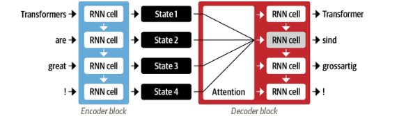
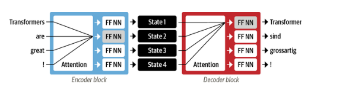
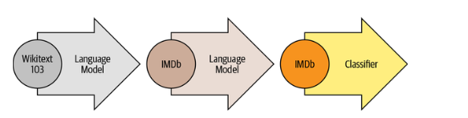
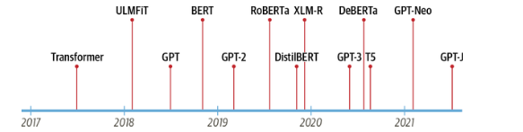

# Chapter 1: Hello Transformers

## Timeline

### 1. Encoder-decoder architecture

* Encoder-decoder architecture with LSTM was the state of the art model for translation tasks LSTM produces an hidden state and also by unrolling produces an memory to accumulate what the context is from previous inputs.

*Unroll RNN*

* Inital Architectures had a single hidden state for a complete sequence
* Encoder encodes the entire sequence into a hidden state and feeds it to decoder
* Decoder has to produce output from this single hidden state as input
* Since there is a only a single hidden state, there's a information bottleneck. If the sequence(passage of 4 rows) is long then the start of the sequence or more information might not be available for decoder to produce output.

### 2. Information bottleneck

* To overcome the information bottleneck, all the hidden states of encoder can be fed to decoder.
* This might be too much information for decoder. To overcome this *attention* came into play. 
* Decoder used *attention* to determine how much each hidden state contributes to produce a token(char or word in output)

*Encoder-decoder architecture with single attention*

### 3. Sequential Processing

* The processing was still sequential with encoder-decoder architecture
* To overcome this and enable parallel processing was introduced in transformers paper.
* Using *self-attention* on both encoder and decoder.
* The transformers paper used a large corpus to train on but not all tasks have such huge amounts of data.

*Transformer architecture*

### 4. Transfer Learning

* Data bottlenect was overcome with transfer learning which was prevalent in computer vision much before NLP.
* ULMFit paper demonstrated this based on unsupervised learning from OpenAI
    * Pretraining -> Train on a larger corpus like (wikipedia or large portion of internet) -- Language modeling
    * Fine Tuning --> Train pretrained model an data specific to problem
    * Classifer --> Attach a classifer based on the problem

*ULMFit*

### Convergence

* With Combination of transformers and transfer learning NLP took off in 2018 and led to GPT and BERT models.
* GPT and BERT set a new sota benchmarks on various NLP tasks.

*Transformers timeline*
