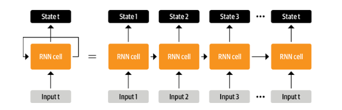

# Chapter 1: Hello Transformers

## Timeline

### 1. Encoder-decoder architecture

* Encoder-decoder architecture with LSTM was the state of the art model for translation tasks LSTM produces an hidden state and also by unrolling produces an memory to accumulate what the context is from previous inputs.

*Unroll RNN*

* Inital Architectures had a single hidden state for a complete sequence
* Encoder encodes the entire sequence into a hidden state and feeds it to decoder
* Decoder has to produce output from this single hidden state as input
* Since there is a only a single hidden state, there's a information bottleneck. If the sequence(passage of 4 rows) is long then the start of the sequence or more information might not be available for decoder to produce output.

### 2. Information bottleneck

* To overcome the information bottleneck, all the hidden states of encoder can be fed to decoder.
* This might be too much information for decoder. To overcome this *attention* came into play. 
* Decoder used *attention* to determine how much each hidden state contributes to produce a token(char or word in output)

*Encoder-decoder architecture with single attention*

### 3. Sequential Processing

* The processing was still sequential with encoder-decoder architecture
* To overcome this and enable parallel processing was introduced in transformers paper.
* Using *self-attention* on both encoder and decoder.
* The transformers paper used a large corpus to train on but not all tasks have such huge amounts of data.

*Transformer architecture*

### 4. Transfer Learning

* Data bottlenect was overcome with transfer learning which was prevalent in computer vision much before NLP.
* ULMFit paper demonstrated this based on unsupervised learning from OpenAI
    * Pretraining -> Train on a larger corpus like (wikipedia or large portion of internet) -- Language modeling
    * Fine Tuning --> Train pretrained model an data specific to problem
    * Classifer --> Attach a classifer based on the problem

*ULMFit*

### Convergence

* With Combination of transformers and transfer learning NLP took off in 2018 and led to GPT and BERT models.
* GPT and BERT set a new sota benchmarks on various NLP tasks.

*Transformers timeline*

## Hugging Face Transformers

Hugging face Transformers made lifer easier for ml practitioniers to apply transformer models from research papers and different frameworks.

Without Transformers library, we'll probabaly have to code the architecture, import pretrained weights from a server, Preprocess data, Create Dataloader, loss, optimizer and train the modek to our specific task. All these steps are avoided with the help of Transformers library.

### pipeline

* `pipeline()` is the highest level of abstraction in transformers API.
* We can just instantiate pipeline(<task-name>) and pass the text to pipeline object, this will return prediction results.

> Note: All different application tour is covered in [1-hello-transformers.ipynb](../notebooks/1-hello-transformers.ipynb)

The models used in the notebook are trained models, where were these models trained, how to fine tune models to a specific task? all these questions will be covered in upcooming notebooks.

## The Hugging Face Ecosystem

Trnasformers provide a big ecosystem of tools to train, finetune, share reproduce machine learning workflow.

The Hugging Face ecosystem can be seperated into two:- Libraries(code) and Hub(pretrained model, weights, datasets, scripts, evaluation metrics and more).

*Ecosystem*

Transformers was covered briefly above and will be discussed in other notebooks.

### The Hugging Face Hub

* Hub enables transfer learning by provifin access to more than 20,000 models. There are filters for tasks, frameworks, datasets and more to help navigation of hub.
* In addition to model weights, Hub also hosts datasets, scripts for computing metrics to reproduce published results or leverage additional data for application.
* *model* and *dataset cards* allow us to document contents of models and datasets to decide the right model for the problem.

### Other components

* Tokenizer --> Numerical representation of text
* Datasets --> Standard format to store datasets, memory mapping to use virtual memory and optimization
* Accelearte --> Training loops