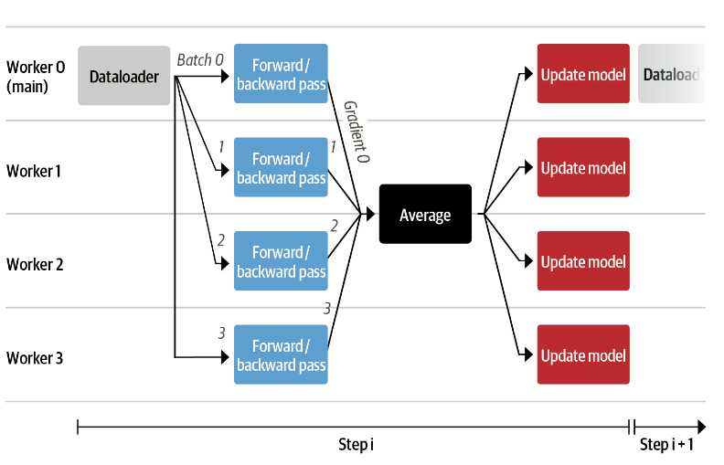

# Training transformers from scratch

📝To train large model with billions of paramters, we need special tools for distributed training... Training a model of this capacity requried multiple GPU's'

📝Choosing between training or fine-tuning depends on two things?

1. Corpus size
    * As the amount of training data we have inches closer to amount of data required for pretraing, it becomes an intersting choice to training the model and tokenizer from scratch(provided the compute resources).
2. Difference between corpus and pretrained model corpus
    * ⚠️ Pretrained model forces us to use it's tokenizer. If the tokenizer is trained on a different domain then the results will be poor, as tokenization is the inital step of converting raw text to numbers.

## Large Datasets and Where to Find Them

There are many domains where large amount of data at hand might be available ranging from biomedical datasets to programming codebases. In mose cases, these datasets are unlabeled, and their large size means that they can usually be labeled thriugh use of heeuristics(past labelling experience) or by using accompanying metadata that is stored during the gathering process.

Nevertheless unlaballed or heuristice labelled large corpus is useful. For instance it can be used to fine tune a language model for domain adaptation.

The decision between fine-tuning and training from scratch is dependent on two things:

1. What's the size of fine-tuning corpus?
2. What's the domain differences between pretrained models and the corpus?

### Challenges of Building a Large-Scale Corpus

Quality of a pretrained model depends on the pretrained corpus itself, as the model inherits defects from the corpus. Hence before creating one, let's become aware of the common issues and challenges associated with building a large corpora for pretraining.

```
Pretraining Corpus[good/bad] ---Training---> Pretrained model[good/bad]
```

***1. Can we be aware of what's inside a very large dataset?***

*As the dataset grows larger and larger, the chances of full control or precise idea of what is inside dimishes.*

***2. How is a large dataset created? which might give some information on visiblity of the dataset***

* *It's not created by dedicated people who create one sample at a time, while being aware and knowledgeable of the full pipeline and the task that the machine learning model will be applied to.*
* *It has more chances of creating in an automatic or semiautomatic way by collecting data that is a side effect of some other activites. For example, it may consists of all the documents(contracts, purchase orders etc.) that a company stores, logs from user activites, or data gatherd from internet.*

***3. What are the consequences of creating a corpora with such high degree of automation?***

* *Limited control over the content and te way ther are created, thus increasing the risk of training a model on biased or lower-quality data.*
* *Recent investigations of large-scale datasets like BookCorpus and C4 which were used to train BERT and T4, have uncoverd (among other things) that:*
    * A significant proportion of the C4 corpus is machine-translated rather than by humans.
    * Disparate erasure of African-American English as a result of stopword filtering in C4 resulted in an underrepresentation of such content.
    * It's typically diffult to find a middle ground between including(often too much) sexually or other explicit content and totally ersation all mention of sexuality or gender. As a surprising consequence of this, a rather common word like sex(both neutral and explicit meanings) is completley unknown to tokenizer that is trained on C4, since this word is absent form corpus.

This discrepancies might not be incompatible if the downstream task requries such a skew. For example, In BookCorpus there's a strong overepresentation of romance novels and if a model is intended to be romance novel writing tool this skew is good for this task.

***Some gpt completions to validate the skew above***

*The below text are generated by two different gpt models of same size on same input prompt but different dataset, gpt-2 is trained on web and blogs reddit articles.*

```
GPT completions:
 1.
When they came back, the next one would be the best.
 the first and only person who might pped a gun was david becker.
 becker stared up at the gray beams from the ceiling. he was terrified. the light was blinding. it
2.
When they came back, she was ready. "
 my jaw had dropped. " you've been watching me? "
 " uh - huh, " he smiled. " i found your address on the phone. "
 that made sense. i
3.
When they came back.
 i would find out soon enough. but right now, my mind was busy processing all the information i was learning to deal with at a late stage of the journey in an uncomfortable sort of way. once we were in the
GPT-2 completions:
 1.
When they came back to look over their shoulders they noticed a tiny black bear and she ran away; I thought they'd be worried, though the bear had a very unusual, large, tail with a large sharp sharp-edged claw.
The
2.
When they came back to him at the top of the stairs.

"I want to say this to anyone in the world out there who's afraid of Muslims," Sahlik said. "Just stop telling me what I don't want
3.
When they came back to work, they said, "I can't do anything about that. This is the best that's possible for me, so I'm sure we'll do something for next year." They also had some ideas. "I
```

On looking at these few samples, we can see the romantic skew in GPT generation, which will typically imagine an interaction between a man and a woman. On the other hand GPT-2 generation trained on webtext linked to and from reddit articles and mostly adopts a neutral *they* in it's generationsm whicg contation "blog-like" or adventure related elemets.

In general, any model trained on dataset will reflect the language bias and over-or underrepresentation of populations and events in its training data. These biases in the behaviour of the model are importatnt to take into consideration with reagard to the target audience interacting with the model.

The brief introduction above will give an idea of the difficult challenges faced during creation of a large corpora. With these in mind, let's create a large dataset.

## Building a Custom Code Dataset

Refer page 681 to 686 to create a custom dataset using below google bigquery.

```Sql
SELECT f.repo_name, f.path, c.copies, c.size, c.content
FROM `bigquery-public-data.github_repos.files` AS f
JOIN `bigquery-public-data.github_repos.contents` AS c ON f.id = c.id
JOIN `bigquery-public-data.github_repos.licenses` AS l ON f.repo_name = l.repo_name
WHERE  NOT c.binary
 AND ((f.path LIKE '%.py')
 AND (c.size BETWEEN 1024
 AND 1048575))
```

* In this section, the results above query is exported to Google bucket and downloaded with gsutil to local.
* BigQuery gives access to google inventory, which has snapshots of github repos to allow us to download data in bulk without limitations of Github REST API.
* The query creates an export of public python repositores in github
* The results of this query is around 2.7TB uncompressed data and 50GB of compressed data.

***To filter the noise or not?***
* We've to make decisions on the noise in the data, 
    * Noise in training data can make system more robust to noisy inputs at inference time
    * Will also make random predictions 
* Depending on intended use and whole system integration, we can choose between more or less noisy data and add pre and post filtering operations.
* Data preparation is a crucial step and we've to clean up the dataset as much as possible.

### Working with large Datasets

Loading a large dataset of 50GB compressed data or 200TB of compressed data into RAM is a challenging task.
`Datasets` is designed in a way to overcome this with two specific features that allows to free from RAM and hard drive space limitations: memeory mapping and streaming.

#### Memory mapping

* Dataset activate zero-copy and zero-overhead memory by default.
* A direct reflection of content in RAM memory is stored as a file in drive(cached). Each dataset is stored in this manner.
* Then a read only pointer is pointed to this file and uses it as a substitute for RAM, basicalluy using hard drive as a extenstion of RAM memory.

--> With above features from Datasets, we can now load a large dataset in a machine provided adequate hard disk space is available.

* In addition to zero-shot/zero-overhead Datasets use Apache Arrow under the hood, which makes it very efficient to access any element. Depeneding on speed of hard drive and batch sizer, we can iterate from tenths of GB to serveral GB/s.

#### Streaming

***What if we don't have enough hard disk space to load data with memory mapping?***

This is where streaming comes in.

* We can push our dataset to huggingface_hub and download the data on the fily.
* We'll get a `IterableDataset`
* With IterableDataset, we've to fetch data in order and cannot access elements randomnly
* `shuffle()` will download samples over a buffer of examples
* This will randomize order of files for every iteration.

To upload files to huggingface_hub refer page 692 to 696.

## Building a Tokenizer

* Now we've a dataset, next we've to efficiently process the data to feed it to the model
* *Can we use tokenizers like in previous notebooks?* -- **No** Because the tokenizers have their preprocessing pipeline for a specific domain or dataset. We've to consider the domain and preprocessing of an Tokenizer(from huggingface) before using it.
* Some pitfalls of using a Tokenizer without understading it's inner workings or tokenizer prepared for another dataset, training can be suboptimal:
    1. If we use T5 tokenizer trained on C4 corputs, we'll never see common English words like "sex." Since it used an extensive stopword filtering to create the dataset.
    2. If we use CamemBERT tokenizer which is trained on French subset of OSCAR corpus, it will be unaware of English words.
* Due to these concers, we've to stick with same preprocessing design choices selected for pretraining. Otherwise the model may be fed out-of-distribution patterns or unkown tokens.

> Training a tokenizer doesn't involve backpropogation or weights like training a model. It's a way to create a optimal mapping of string of text to a list of integers that can be ingested to a model. In today's tokenizers the optimal sstring to integer conversion involves:
    1. A list of atomic strings vocabulary
    2. A method to cut, normalize or map a text string into a list of indices with this vocabulary. This is then fed to our neural network.

### The Tokenizer Model

The tokenizer pipeline consists of four steps, The third step tokenizer model uses sub word alogrithms to determine the vocabulary using data corpus. There are several sub word alogrithms like BPE, Unigram, WordPiece.

* *BPE* Vocabulary creation:
    1. Starts with basic units(single characters)
    2. Merges most frequently occuring basic units to create new tokens
    3. Adds them to vocabulary
This process is reiterated until defined vocabulary size is reached

* *Unigram* Vocabulary creation:
    1. Starts with all words and potential subwords from corpus
    2. The removes or splits the less useful tokens to reduce vocabulary size
Repeats step 2 until target vocabulary search is reached.

* *Wordpiece* is a predecessor of unigram and its official implementation was never open-source to google.

### Measuring Tokenizer Performance

The optimality and performance of a tokenizer are challenging in practice. Some possible metrics include:

* *Subword fertility* -> Calculates the average number of subwords produced per tokenized word
* *Proprtion of continued words* -> Proportion of tokenized words in a corpus that is split into at least two subtokens
* *Coverage metrics* -> Proportion of Unkown words or rarely used tokens in a tokenized corpus

In addition robustness to mispelling or noise as well as models performance on out-of-domain examples.

These metrics give a different view but ignores the interaction with the model. For example subword fertility can be increased by including all tokenized words but this increases the overall vocabulary for the model.

In the end, performance of a tokenizer depends on the model downstream task. For instance, the good performance of early approaches was demonstrated by showing improved performance of machine translation tasks by models trained using these tokenizers and vocabularies instead of character or word based tokenization.

### A Tokenizer for python

A natual language tokenizer will split the code based on whitespace, underscore, punctutations etc... This will not be good for python tokenizer. Considering the python languages:
    * Splitting based on whitespace will lose all indentation informations
    * undserscore will split variable names or functions
    * Punctuations will split . notation method call

We need a tokenizer that preservers space, so a good candidate could be a byte-level tokenizer like the one from GPT-2. Let's load this tokenizer and explore its tokenization properties.

> **Note:** Python has an inbuilt *tokenize* model that splits Python code strings into meaningful units(code operation, comments, indent and dedent, etc.). But this pretokenizer is python-based and such is typically rather slow and limited to python GIL. On the other hand, most of the tokenizers in Transformers library are provided by the Tokenizer library and coded in Rust. Rust tokenizers are many orders of magnitude faster to train and use. These are more suited for large corpus like in our case,

To understand the Output of GPT-2 tokenizer, text to byte level to unicode, building a vocablary, training a custom tokenizer. Refere to `Understanding the output`, `Training Tokenizer` section in notebook.

## Training a Model from Scratch

In this section, we'll cover below:

1. Architecture for the task
2. Loading a fresh model without pretrained weights
3. Custom data loading class
4. Scalabale training loop

> Since this code is a script setup to run on distributed infrastructure, Colab(free tier) or my machine doesn't have enough compute to run the code. Hence we'll be covering all the code in this itself instead of a jupyter notebook. The tip from book also suggests to run it as a script instead of running it as seperate cells with Accelerate. [Source scripts](https://github.com/huggingface/transformers/tree/main/examples/research_projects/codeparrot)

### A Tale of Pretraining Objectives

Now that we've access to a large corpus, an efficient tokenizer, we can start thinking about how to pretrain a tokenizer model. With such large corpus, we can tackle several tasks. Which one we choose will determine our choice of pretraining objectives. Let's have a look at three common tasks:

#### Casual Language Modeling

Casual langauge modeling objective is to predict next token or character give a context in conversational or informal style. This is self-supervised training objective where we can use a dataset without annotations. A directly related downstream task is autocompletion. A decoder-only architecture such as GPT family of models is best suited for this task.

#### Masked Language Modeling

Masked language modeling objective is to reconstruct the original sample give a sample with replaced or masked tokens. This is also a self-supervised training objective and called as denoising objective. It's harder to think about downstream tasks but mlm denoising is generally a good pretraining task to learn general representations for later downstream tasks. Models like BERT, XLM-RoBERTa pretaining objective is mlm or denoising.

#### Sequence-to-sequence training

An alternative is to use heuristic like regular expressions to seperate code, comments. Use code, comments as input, labels to train a seq-to-seq model to translate code to comment and vice versa. Provided a clean, diverse. large dataset and a model with sufficient capaciity, we can train this model. This a *supervised learning* inputs, labels. In this translation of sequences, we can use encoder-decoder models like T5, BART, and PEGASUS.
Relative downstream tasks include code generation, documentation generation.

Since we want to build a autocompletion model, we'll select the first objective and choose a GPT architecture for the task. So let's initalize a fresh GPT-2 model!

### Initializing the model

This is the first time in the sequence of notebooks, we'll use `from_pretrained()` to intialize a new model instead of loading a model. We'll load the configuration of `gpt2-xl` so we can use the same hyperparameters with changing the vocab size alone. Then initialize a new model using this config `from_config()`.

```Python
from transformers import AutoConfig, AutoModelForCasualLM, AutoTokenzier

tokenizer = AutoTokenizer.from_pretrained("transfrormers/codeparrot")
config = AutoConfig.from_pretrained("gpt2-xl", vocab_size=len(tokenizer))
model = AutoModelForCasualLM.from_config(config)
```

This is a 1.5B parameter model! This is a lot of capacity but we also have a large dataset. *In generatl LLM are more efficient to train as long as the dataset is reasonably large*. Larger dataset, complex model no underfitting, This follows the regular principle of underfitting and overfitting.

We'll start with smaller version to train and make sure everything works before scaling up. we'll use standard GPT-2 size s base:

```Python
tokenizer = AutoTokenizer.from_pretrained("transfrormers/codeparrot")
config_small = AutoConfig.from_pretrained("gpt2", vocab_size=len(tokenizer))
model_small = AutoModelForCasualLM.from_config(config_small)
```

The number of paramaeters in this model is 110.0M parameters.

Now we've two trainable models. We've to make sure we can feed them input data efficiently during training.

### Implementing the Dataloader

To be able to train with maximal efficieny, we will want to supply the our model with sequences filling its context. For example if the context length of our model is 1024 tokens, we always want to provide 1024 sequences during training. But we've to pad short code sequences or truncate long code sequences. Padding will require addition of padding tokens plus masking to avoid training for pad tokens. This requires more compute, we're more compute constrained than data constrained, so we'll take the easy and efficient way here. We'll tokenize several examples and concatenate them, seperated by eos token to get a very long sequence. Finally we split this sequence into equally sized chunks. With this approach we'll lose a small fraction at the end and don't create a bias by cutting off majority of file endings.


We can for instance, make sure we have roughly one hundred full sequences in our tokenized examples by defining our input string character length as:

input_characters = number_of_sequences * sequence_length * characters_per_token

where:

* `input_characters` -> number of characters in the string input to our tokenizer.
* `number_of_sequenes` -> number of truncated sequences to be tokenized.
* `sequence_length` -> number of tokens per sequence returned by tokenizer.
* `characters_per_token` -> average number of characters per output that we first need to estimate

If we input a string with `input_characters`, we'll get an averge of `number_of_sequences` output sequences. We can calculate the data lost by truncating the last sequence. If `number_of_sequences=100` it means we stack roughly 100 sequences and at most lose the last element, this corresponds to at most losing 1% of our dataset. This approach alos ensures a bias by cutting off the majority of file endings.

How to estimate the average character length per token on our dataset:

```Python
examples, total_characters, total_tokens = 500, 0, 0
dataset = load_dataset('transformers/codeparrot-train', split='train')

for _, example in tqdm(zip(range(examples), iter(dataset)), total=examples):
    total_characters += len(example['content'])
    total_tokens += len(tokenizer(example['content']).tokens())
characters_per_token = total_characters / total_tokens
```

With that we have all that's needed to create our own `IterableDataset`(PyTorch helper class) to provide constant-length inputs for the model. To do this we'eve to inherit the class nad implement the logic discussed in `__iter__()` that yields next element.

```Python
import torch
from torch.utils.data import IterableDataset

class ConstantLengthDataset(IterableDataset):

    """
    A iterable generator class to yield constant length sequences
    """

    def __init__(
        self,
        tokenizer,
        dataset,
        seq_length=1024,
        num_of_sequences=1024,
        chars_per_token=3.6
    ):
        """
        tokenizer(Tokenizer): Tokenizer to tokenize the sequences
        dataset (datasets): Dataset to be used
        seq_length (int): Defaults to 1024. Context length of the model
        num_of_sequences (int): Defaults to 1024. Number of sequences to yield by Iterator
        chars_per_token (int): Defaults to 3.6 for the codeparrot dataset
        """

        self.tokenizer = tokenizer
        # Token to place between sequences
        self.concat_token_id = tokenizer.eos_token_id
        self.dataset = dataset
        self.seq_length= seq_length
        self.input_characters = seq_length * chars_per_token * num_of_sequences

    def __iter__(self):
        iterator = iter(self.dataset)
        more_examples = True
        while more_examples:
            buffer, buffer_len = [], 0
            while True:
                if buffer_len >= self.input_characters:
                    message =f"Buffer full: {buffer_len}>={self.input_characters:.0f}"
                    print(message)
                    break
                try:
                    message=f"Fill buffer: {buffer_len}<{self.input_ccharacters:.0f}"
                    print(message)
                    buffer.append(next(iterator)["content"])
                    buffer_len += len(buffer[-1])
                # To catch when no example is left in iterator
                except StopIteration:
                    # Reset the iterator to iterate from beginning
                    iterator = iter(self.dataset)

            # When buffer_len == self.input_characters
            all_token_ids = []
            # Convert list of sequences to tokens using tokenizer
            tokenized_inputs = self.tokenizer(buffer, truncation=False)
            # Access input_ids of each sequence and add it to a single like like sequence_0 + eos + sequence_2 + eos ....
            for tokenized_input in tokenized_input["input_ids"]:
                all_token_ids.extend(
                    tokenized_input +
                    [self.concat_token_id] # eos token to identify end of input sequence
                )
            
            # Loop through all token ids of num_of_sequences sequences from o to last token_id with a step of seq_length
            # And yield sequences one by one
            for i in range(0, len(all_token_ids), self.seq_length):
                input_ids = all_token_ids[i:i+seelf.seq_length]
                if len(input_ids) == self.seq_length
                yield torch.tensor(input_ids)
```

Here padding, masking is not required, as we've provide sequences of the same(maximal) length and reuturn `input_ids` alone.

We can use the below code to validate the DatasetIterator and sequences are of maximum length.
```Python
# Setting buffer size allows to shuffle the examples in buffer instead of shuffling the entire dataset.
# As this is an iterable dataset
shuffled_dataset = dataset.shuffle(buffer_size=100)
constant_length_dataset = ConstantLengthDataset(tokenizer, shuffled_dataset,
                                                num_of_sequences=10)
dataset_iterator = iter(constant_length_dataset)

lengths = [len(b) for _, b in zip(range(5), dataset_iterator)]
print(f"Lengths of the sequences: {lengths}")
```

With this reliable data source for the model, it's time to build the actual training loop.

## Define the Training Loop

One obvious limitation with training our own language model is the memory limitations with GPU or even on a modern graphic card, we can't train a model at GPT-2 scale in reasonable time. In this notebook, we'll implement *data parallelism* to utilize several GPU's for training.

***Accelerate*** library can be used to make our code scalable.

The Accelerate library is designed to make distributed training --- and chanding underlying hardware for training easy. We can also use `Trainer` for distributed training but Accelerate gives full control over training loop which we want to explore here.

We only have to make handful of changes to native PyTorch training loop to use Accelerate. Accelerate provides an easy to use API to make training scripts run with mixed precision and in any kind of distributed setting(single GPU, multiple GPUs and TPUs).

```Python
# Accelerate code changes on native PyTorch training loop
import torch
import torch.nn.Functional as F
from datasets import load_dataset
from accelerate import Accelrator

# device = 'cpu'
accelerator = Accelrator()

# model = torch.nn.Transfomer().to(device)
model = torch.nn.Transformer()

optimizer = torch.optim.Adam(model.parameters())
dataset = load_dataset("dataset_name")
dataloader = torch.utils.data.DataLoader(dataset, shuffle=True, batch=True)

model, optimizer, dataloader = accelerator.prepare(model, optimizer, dataloader)

# Put model to training model
model.train()

for epoch in range(10):
    for source, targets in data:
        # source = source.to(device)
        # target = target.to(device)
        output = model(source)
        optimizer.zero_grad()
        loss = F.cross_entropy(outputs, targets)
        # loss.backward()
        accelerator.backward(loss)
        optimizer.step()
```

The core part of the changes is `prepare()` which prepares model, otpimizer, dataloders for training on distributed infrastructure. These minor changes helps us to scale training across different infrastructures. With that in mind, let's start building our training script and define a few helper functions. First we set up the hyperparameters for training and wrap them in a `Namespace` for easy access.

```Python
from argparse import Namespace

config = {
    "train_batch_size": 2,
    "valid_batch_size": 2,
    "weight_decay": 0.1,
    "shuffle_buffer": 1000,
    "leraning_rate": 2e-4,
    "lr_scheduler_type": "cosine",
    "num_warmup_steps": 750,
    "gradient_accumulation_steps": 16,
    "max_train_steps": 50000,
    "max_eval_steps": -1,
    "seq_length": 1024,
    "seed": 1,
    "save_checkpoint_steps": 50000
}
args = Namespace(**config)
```

Since we're gonna train the model from scratch it's gonna take a while and require expensive infrastructure. Therefore, we want to make sure all the relevant information is stored and easily accessible. We'll setup three levels of logging: 
    1. Python Logger
    2. TensorBoard
    3. Weights & Biases

Depending on preference we can add or remove logging frameworks here.

```Python
from torch.utils.tensorboard import SummaryWriter
import logging
import wandb

def setup_logging(project_name):
    logger = logging.getLogger(__name__)
    logging.basicConfig(
        format="%(asctime)s - %(levelname)s - %(name)s - %(message)s",
        datefmt="%m/%d/%Y %H:%M:%S",
        level=logging.INFO,
        handlers=[
            logging.FileHandler(f"log/debug_{acceleartor.process_index}.log"),
            logging.StreamHandler()
        ]
    )

    # Main worker
    if accelrator.is_main_process: # setup logging once only
        # To track experiments
        wandb.init(
            project=project_name, #Project name for wandb
            config=args, # Arguments to track
            )
        run_name = wandb.run.name
        # To track hyperparameters
        tb_writer = SummaryWriter()
        tb_writer.add_hparams(vars(args), {'0': 0})
        logger.setLevel(logging.INFO)
        datsets.utils.logging.set_verbosity_debug()
        transformers.utils.logging.set_verbosity_info()

    # Other workers
    else:
        tb_writer = None
        run_name = ''
        logger.setLevel(logging.ERROR)
        datasets.utils.logging.set_verbosity_error()
        transformers.utils.logging.set_verbosity_error()
    return logger, tb_writer, run_name
```

Each worker gets a unique `acceleartor.process_index` which we'll use to store logs from different workers to diferent files. `accelrator.is_main_process` is True for main worker alone, we use this to set higher level logs for main worker alone and lower(less) level logs for other workers. We also make sure the logger is init only once.

Next, a helper function to log the metrics with TensorBoard and Weights&Biases. We'll again use `accelrator.is_main_process` here to ensure that we only log the metrics once and not for each worker.

```Python
def log_metrics(step, metrics):
    logger.info(f"Step {step}: {metrics}")
    if accelrator.is_main_process:
        wandb.log(metrics)
        [tb_writer.add_scalr(k,v,step) for k, v in metrics.items()]
```

Next, a function to create dataloder for training and validation sets with `ConstantLengthDatset` class:

```Python
from torch.utils.data.dataloder import DataLoader

def create_dataloaders(dataset_name):
    train_data = load_dataset(dataset_name+'-train', split="train", streaming=True)
    train_data = train_data.shuffle(buffer_size=args.shuffle_buffer, seed=args.seed)
    valid_data = load_dataset(dataset_name+'-valid', split="validation", streaming=True)
    train_dataset = ConstantLengthDataset(tokenizer, train_data, seq_length=args.seq_length)
    valid_dataset = ConstantLengthDataset(tokenizer, valid_data, seq_length=args.seq_length)

    train_dataloader = DataLoader(train_dataset, batch_size=args.train_batch_size)
    eval_dataloader = DataLoader(valid_dataset, batch_size=args.valid_batch_size)
    return train_dataloader, eval_dataloader
```

At the end we wrap the dataset with DataLoader, which provies batching, shuffling, prefetch(fetching next set of samples), augumentation etc. Accelerate will take care of distributing the batches to each worker.

We'll define the optimizer and learning rate schedule in the main loop. Next we'll define a helper to differentiate parameters that should recieve weight decay. LayerNorm(normalizing distributions), bias(shift or offset) doesn't need reugularization.

```Python
def get_grouped_params(model, no_decay=["bias", "LayerNorm.weight"]):
    params_with_wd, params_without_md = [], []
    for n, p in model.named_parameters():
        if any (nd in n for nd in no_decay):
            params_without_wd.append(p)
        else:
            params_with_wd.append(p)
    return [
        {"params": params_with_wd, "weight_decay": args.weight_decay},
        {"params": params_without_wd, "weight_decay": 0.0}
    ]
```

Finally, we want to evaluate the model on validation set from time to time, let's create an evaluation function that calculates the loss and perplexity on evaluation set:

```Python
def evaluate():
    model.eval()
    losses = []
    for step, batch in enumerate(eval_dataloader):
        with torch.no_grad():
            outputs = model(batch, labels=batch)
        loss = outputs.loss.repeat(args.valid_batch_size)
        losses.append(accelerator.gather(loss))
        if args.max_eval_steps > 0 and step >= args.max_eval_steps: break
    loss = torch.mean(torch.cat(losses))
    try:
        perplexity = torch.exp(loss)
    except OverflowError:
        perplexity = torch.tensor(float("inf"))
    return loss.item(), perplexity.item()
```

The perplexity measures how well the model's output probabality distributions predicts the targeted tokens. Perplexity is exponent of cross entropy loss. Lower perplexity -> good performance. When the loss is still high at the start of training numerical overflow might occur with perplexity calculation. We catch the overflow and set perplexity to infinity in these instances.

One last function to push model checkpoints to hugging face hub during training. With `Repository` class we can do this programatically. Since hub uses Git under the hood, we can do pull, push, branch, commit etc.

Here comes the complete training script:

```Python
# Setting seed to maintain same randomness in every run
set_seed(args.seed)

# Accelerator for distributed training
accelerator = Accelerator()
samples_per_step = accelerator.state.num_processes * args.train_batch_size # Number of samples required for every step

# Logging
logger, tb_writer, run_name = setup_logging(project_name.split("/")[1])
logger.info(accelerator.state)

# Load dataset, dataloader
train_dataloader, eval_dataloader = create_dataloders(dataset_name)

# Prepare the optimizer and learning rate scheduler
optimizer = AdamW(get_grouped_params(model), lr=args.learning_rate)
lr_scheduler = get_scheduler(
    name=args.lr_scheduler_type,
    optimizer=optimizer,
    num_warmup_steps=args.num_wamup_steps,
    num_training_steps=args.max_train_steps,
)

def get_lr():
    return optimizer.param_groups[0]["lr"]

# Prepare everything with accelerator
model, optimizer, train_dataloader, eval_dataloader = accelerator.prepare(
    model, optimizer, train_dataloader, eval_dataloader,
)

# Train model
model.train()
completed_steps = 0
for step, batch in enumerate(train_dataloder, start=1):
    loss = model(batch, labels=batch).loss
    log_metrics = (
        step, {"lr": get_lr(), "samples": step*samples_per_step, "steps": completed_steps, "loss/train": loss.item()}
    )
    loss = loss / args.gradient_accumulation_steps
    accelerator.backward(loss)

    if steps % args.gradient_accumulation_steps == 0:
        optimizer.step()
        lr_scheduler.step()
        optimizer.zero_grad()
        completed_steps += 1
    if step % args.save_checkpoint_steps == 0:
        logger.info("Evaluating and saving model checkpoint")
        eval_loss, perplexity = evaluate()
        log_metrics(step, {"loss/eval": eval_loss, "perplexity": perplexity})
        accelerator.wait_for_everyone()
        unwrapped_model = accelerator.unwrap_model(model)
        if accelerator.is_main_process:
            unrapped_model.save_pretrained("./")
            hf_repo.push_to_hub(commit_message=f"step {step}")
        model.train()
    if completed_steps >= args.max_train_steps: 
        break

# Evaluate and save the last checkpoint
logger.info('Evaluating and saving model after training')
eval_loss, perplexity = evaluate()
log_metrics(step, {'loss/eval': eval_loss, 'perplexity': perplexity})
accelerator.wait_for_everyone()
unwrapped_model = accelerator.unwrap_model(model)
if accelerator.is_main_process:
    unwrapped_model.save_pretrained("./")
    hf_repo.push_to_hub(commit_message=f'final model')
```



Let's walk thorugh the code block and highlight the most important parts:

*Model saving:*

* The script is run within the model repository.
* We use the run_name from wandb to create a new branch for each experminent and every commit is a checkpoint.
* We need to call `wait_for_everyone()` and `unwrap_model()` to make sure the model is properly synchronised when we store it.

*Optimization:*

* For model optimization we use `AdamW` with a cosine learning rate scheduler after a linear warming-up period.
* For hyperparams, we closley follow the parameters described in the gpt-3 paper for similar sized models.

*Evaluation:*

* At every save_checkpoint, we evaluate the model with evaluation data and save the model with validation loss and perplexity.

*Gradient accumulation and checkpointing:*

* With larger models, we can't even fit a single batch on latest GPU's.
* So we accumulate gradients over certain steps and perform optimization and step. 
* We can do this with `Trainer` as well.
* This method is called *gradient checkpointint* we can trade some of the memory footprint for an approximatley 20% training slowdown.

We still don't know how accelerate performs distributed training. It uses [Distributed data parallelism](https://pytorch.org/tutorials/intermediate/ddp_tutorial.html) to train models faster with larger batch size that wouldn't fit into any single GPU.


Let's go throught the pipeline step by step:

1. Each worker consists of a GPU. In Accelerate, there is a dataloder running on the main process that prepares batches of data and sends them to all workers.
2. Each worker performers forward, backward pass and accumulates gradients with a local copy of the model.
3. The gradients from each node are averaged with the *reduce* pattern and sent back to each worker.
4. The gradients are updated with optimization step at each workers. This avoids the copying of model between workers and the wait time during copy is avoided.
5. Once all models are updated, we start all over agin with the main worker preparing new batches.

This simple pattern allows us to train extremley large models extremley fast by scaling up the number of available GPU's without much additional logic. Sometimes the model might not fit inside a single GPU, we need more sophisticated parallelism strategies.

## The Training Run

Since hub repos are essential github repos we can add our training script and requirements.txt to hub repo. Then with the below commands we can perform the training run:

```zsh
git clone <hugging face repo link>
cd repo
pip install -r requirements.txt
wandb login
accelerate config
accelerate launch training_script.py
```

wandb login -> provide wandb creds
accelerate config -> to setup infrastructure

This code_parrote experiment uses 16 A100 GPUs with 40GB memeory each.

Running the training script takes 24 hours and 7 days for small and large models respectivley. Since the infrastructure is expensive and time taken is large, it's best to try out the script in smaller infra before scaling up the run.

Once the run is exompleted we can merge the experiment branch on the Hub using git commands.

## Results and analysis

For results and analysis i'll do a quick brief.
our task is code autocompletions, so evaluation of model will be based on that.
We can do qualititaive(differnt tasks) and quantitative(over a large set of examples) tests.
BLEU can be used to evaluate text genration but the way of writing code(variables, functions, classes) vary between human coders, but BLEU score is based n-grams in original vs n-grams in prediction which will be bad for this task.
The better evaluation will be to write test cases, generate code and test them against test cases.

For more details on this section refer the book(got a little tired at the end and excited to try out the learning from this series).