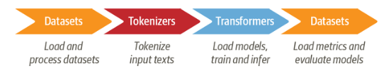

# Text Classifiation

Text classification is one of the most common tasks in NLP. It can be used for a broad range of applications, like tagging customer feedback, classifying a ticket to particular queue etc.

## Problem:

Sentiment analysis is another common text classification task. We can build a system to identify emotions based on text.

We'll tackle this with a DistillBERT. The code will be covered in [2-text-classification.ipynb](../notebooks/2-text-classification.ipynb)

*checkpoint* for models corresponds to a set of weights that are loaded into a given transformer architecture.

A typical model fine-tuning with datasets, tokenizers, transformers looks like below,

## Tokenizers:

Tokenizer are used to convert raw text to input_ids. Tokenizer might use one of the follwoing three techniques to split the string,
    1. Character tokenization --> Requires more compute, training time as it needs to learn words from characters
    2. Word tokenization --> Less compute, to accomdate words loss of information with `UNK` token for unknow words 
    3. Subword tokenization --> Combines both character and word tokenization. Splits rare or mispelled words and keeps frequent unique words. Most of these tokenizer will be available from a pretrained corpus with staistical rules.

* `AutoTokenizer` class loads pretrained weights, vocabulary and configuraion based on checkpoint or id of the model.
* We also have a seperate tokenizer as well.
* `convert_ids_to_tokens()` --> to convert id's to tokens.
* `convert_tokens_to_string()` --> to convert tokens to string.
* `vocab_size`, `model_max_length`, `model_input_names` are some params available with tokenizer.

## Feature Extraction

* Feature extraction is getting vector representations(last hidden state) from a pretrained model for our inputs.
* These n-dimension hiddens states goes through a dimension reduction with Umap.
* Then a sciki-learn classifier is trained
* This method is good choice for a less compute constraint.

## Fine Tune

* Fine tune is train the entire pretrained model to the current dataset
* Training the classification head

