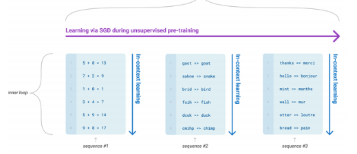
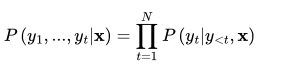
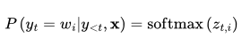
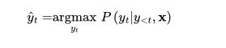
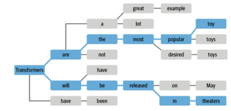

# Text-Generation

Transformer language models has an uncanny feature of generating text that is almost indistinguishable from human text. This text generation happens without any explicit supervised leraning, just by predicting the next word based on context in a millions of web pages. With just pretraining LLM's learn a special set of skills and pattern recognition abilites that can be activated with different kind of prompts.



The image shows addition, unscrambling, translation are some of the sequence tasks that an LLM is exposed during training. This knowledge is transferred during fine-tuning(for larger models during inference-time). These tasks are not chosen specifically ahead of time and occur naturally with huge corpora.

With the advent of GPT-4 and now an open sourced LLAMA2, has given rise to lot's of applications with LLM's at its core with text generation capacity.

In [5-text-generation.ipynb](../notebooks/5-text-generation.ipynb) notebook we'l11l cover how text generation works with LLM's and how different decoding stratergies impact text generation.

## The Challenge with Generating coherent Text

Until now in the series of notebook, we used a body and a fine-tuned head to get logits. Then we use argmax on logits to get a predicted class or softmax to get prediction probabalites for each token. By contrast, converting the model's probablistic output to text requries a *decoding method*, which introduces a few challenges unique to text generation:

* The decoding is done *iteratively* and requires more compute, not like passing the inputs through forward pass just once.
* The *quality* and *diversity* of text generated depends on the decoding method and associated hyperparameters.

To understand how this decoding process works, let's start by examining how GPT-2 is pretrained and subsequently applied to genreate text.

Like other *autoregressive* or *casual language models* GPT-2 is pretrained to estimate the probabality p(X|Y) of a sequence of tokens **y** = y1, y2,...yt, given some initial context **x** = x1, x2,...xt. Since it's impossible to acquire enough training data, the chain rule of proabality is used to factorize it as a product of *conditional probabalities*.

*Predicting token c given a and b are before it is the conditional probablity intutition*.



The note above describe exactly the probablity calculation on right side. This pretraining objective is quite different from BERT's, which utilizer both past and furture contexts to predict a masked token.

We can generate a text by predicting next token, adding it to the sequence and use this as new sequenct to predict next token and continue this iterative process until a special end of sequence token.

Example of this process below,
[text-generation](../notes/images/5-text-generation/text-generation.png)

> **Note:** Since the output sequence is *conditioned* on the choice of input prompt, this type of text genreation is often called as *conditional text generation*.

At the heart of this process lies the decoding method that determines which token is selected at each time step.

A language model produces a logit for each word in  the vocabulary at each time step, we can get the probabality distribution for each token using softmax.



The goal of most decoding methods is to search for the most likely overall sequence by picking a y_hat such that:


Finding y_hat directly involve evaluating every possible sequence with the language model. Since there does not exist an algorithm to do this within an reasonable amount of time we use approximation instead. In this note, we'll explore few of these approximation methods and gradullay build up toward smarter and more complex algorithms that can gernerate high quality texts.

## Greedy Search Decoding

The simplest decoding method to get discrete tokens from a model's continuous output is to greedily select the token with the highest probabality at each timestep.

*Greedy search decoding argmax*


### Greedy Search with huggingface transformers

1. Load tokenizer and casualLM model
2. CasualLM body has an generate(), which can be used to perform different decoding strategies with ease.
3. tokenize input text, and pick input_ids from tokenizer output
4. Call generate() and pass input_ids, max_length(number of new tokens to generate), do_sample(False) - This enables the greedy search decoding.

```Python
model_name = "gpt2-medium"
tokenizer = AutoTokenizer.from_pretrained(model_name)
model = AutoModelForCausalLM.from_pretrained(model_name)
max_length = 128
input_txt = """In a shocking finding, scientist discovered \
a herd of unicorns living in a remote, previously unexplored \
valley, in the Andes Mountains. Even more surprising to the \
researchers was the fact that the unicorns spoke perfect English.\n\n
"""
input_ids = tokenizer(
    input_txt,
    return_tensors="pt"
)["input_ids"].to(device)
output_greedy = model.generate(
    input_ids, # Input encoded ids from tokens
    max_new_tokens=max_length, # Number of tokens to generate
    do_sample=False
)
```

Output shape will be
[number_of_sequences, input_ids_len + max_length]

To get the text from output... 
```Python 
print(tokenizer.decode(output_greedy[0]))
```

With greedy search, sequences will get repeated in text generation why? Because we'll select the token with most probabality at every time step, regardless of the overall sequence probabality. Hence repetiton occurs in greedy search decode.

> 1. To generate good sequences without repetition, it'll be better to choose tokens based on the overall sequence probabality
> 2. Greedy search is useful for deterministic and factually correct output like arithmetic cases.

## Evaluating decoding strategies with sequence probabality

* Conditional probablities is between [0,1] calculating sequence probabality requires product of conditional probabality of each individual token. This'll become a really small number which the computer won't be able to represent the result and cause underflow. This'll also cause numerical unstability.
* To avoid this risk we'll apply log on top of conditional probabality. Logarithmic probablity will scale the conditional probabality to avoid the numerical unstability.
* With log probabality of overall sequences, we can compare different decoding strategies.

### How to calculate log probabality of a sequence?

To calculate this, we need:

1. Token ids from text generation output
2. Logits for each of the predicted tokens

Once we have these, we've to align the logits with labels(token ids):
1. We can remove the first token logit, as it won't be available
2. We can remove the last label as it's a prediction and no label will be available

After this we've to match shapes:
1. shape of logits -> (number_of_sequences, number_of_tokens, vocab_size)
2. shape of labels -> (number_of_sequences, number_of_tokens)

last_dim in logits contains the log probabalites of all possible tokens. We've to pick the label log probabality from logits. To do this we'll stretch labels along last dim to match shape of logits.

After unsqueeze shape of labels -> (number_of_sequences, number_of_tokens, 1)

Now we can pass these to torch.gather to pick the log probabality of label ids for rach token.

Code looks like this:
```Python
# We'll ignore the last token logit as we don't have truth label
# We don't use the logit for the first label
op_x = op.logits[:, :-1, :]
label_x = output_greedy[:, 1:]
```

*Log probs from logits*
```Python
# Function to calculate log probabality for a single token
import torch.nn.functional as F
def log_probs_from_logits(logits, labels):
  """
  Function to get log probabality for a single token
  """
  # [1, 175, 50257] --> [1, 175]
  logp = F.log_softmax(logits, dim=-1)
  logp_label = torch.gather(
      logp, # Logits
      2, # Dimension to gather tensors,
      labels.unsqueeze(2), # Tensor indexes to gather
  ).squeeze(-1)
  return logp_label
```

*Sequence probabality*
```Python
def sequence_logprob(model, labels, input_len=0):
  with torch.no_grad():
    output = model(labels)
    log_probs = log_probs_from_logits(
        output.logits[:, :-1 :],
        labels[:, 1:],
    )
    seq_log_prob = torch.sum(log_probs[:, input_len:])
    return seq_log_prob.cpu().numpy( )
```

*Call*
```Python
logp = sequence_logprob(
    model,
    output_greedy,
    input_len=len(input_ids[0])
)
print(tokenizer.decode(output_greedy[0]))
print(f"\nlog-prob: {logp:.2f}")
```
> The lower the log proabablity, better the results of decoding strategy used.

## Beam Search Decoding

Instead of decoding with the next highest probable token, beam search decoding keeps track of the ***top-b*** most probable next tokens, where *b* is refrred to as ***number of beam*** or ***partial hypotheses***. Then the next set of beams will be chose based on the current beams. This process is repeated until eos token or max_length. Finally the sequence is selected based on ranking the *b* beams accordig to log probabalities or the beam path of a sequence with highest probabality.



We get a higher(higher is better) log probabality compared with greedy search decoding. To improve the text generation and reduce repetitive text, we can impose an n-gram penalty with the `no-repeat_ngram_size` paramter that tracks which *n-grams* have been seen and sets the next token probabality to zero if it would produce a previously seen n-gram:

*Sample beam search call with huggingface transformers*

```Python
ouput_beam = model.generate(
  input_ids,
  max_length=max_length,
  num_beams=5,
  do_sample=False,
  no_repeat_ngram_size=2,
)
```

## Inference on decoding methods

* Beam search with n-gram penalty is a good way to find a trade-off between focusing on high-probabality tokens(with beam search) while reducing repitions(with n-gram penalty). This is commonly used in application such as summarization or machine translation where factual correctness is important.

* Another alternative to reduce reptitions with increase in text diversity and reduced factual corectness(chatbot, story generation applications) we can use sampling. We'll explore sampling next.

## Sampling Methods

The simplest sampling method is to randomly sample from the probabality distribution of the model's outputs over the full vocabulary at each timestep.

We can easily control the diversity of the output by adding a temperature parameter T that rescales the logits before taking the softmax.

By Tuning T we can control the shape of the probabality distribution. When T << 1, the distribution becomes peaked around the origin and the rare tokens are suppressed. On the other hand wher T >>1 the distribution flattens out and each token becomes equally likely. Let's observe this effect of temeperature on token probabalities next.

The text with low temperature is more coherent.

> **Note**: Main point with temperature is it allow us to control the quality of the samples, but there's always a trade-off between coherence(low temperature) and diversity(high temperature) that one has to tune to the use case at hand.

Another way to adjust the trade-off between coherence and diversity is to truncate the distribuion of the vocabulary. This allows us to adjust the diversity freely with temperature but with a limit that excludes word that would be too strange in the context(i.e low probabality words). There are two main ways to do this top-k and nucleus sampling.

## Top-k and Nucleus Sampling

Top-k and nucleues(top-p) sampling are two popular alternatives or extensions to using temperature. In both cases, the basic idea is to restrict the number of possible tokens we can sample from at each timestep. To see how this works, let's first visualize the cumulative probabality distirbution of the model's outputs at T=1.

### Top-k sampling

The idea of top-k sampling is to select tokens from the top k tokens alone. We'll be cutting the tokens tail at the point k to make sure tokens with less probabality are not sampled.

Looking again at the graph, we can say it's like drawing a vertical line on a decreasing probabality of tokens.

We can do this easily with `generate()` function and `top_k` argument.

### Top-P sampling

In Top-P sampling we set a probabality limit,
* tokens are first sorted in descending order of probabality
* Then tokens probabality are added cumulativley until we reach this limit. Once we reach this limit, all the tokens contributed to this mass(limit we set) are selected.
* From this group of tokens next token is sampled.

With respect to the plot, this can be considered as a horizontal line in decresing tokens probabality and all the tokens below it can be used for sampling.

This makes it dynamic with respect to output distribution at each time step instead of a static count like top-k sampling.

We can implement this with `generate()` by passing `top_p` paramter.

## Inference on sampling methods

* temperature controls the probabality distribution to sample tokens from
* top-k restriction on token level, A select number of tokens at every timestep to select from
* top-p restriction at probabality level at each timestep

## Which decoding method is best?

There is no *best* decoding method, it all depends on the nature of task to genrate text for?

* Use greedy search in combination with beam search for arithemetic or providing answer to a specific question.
* To generate diverse text, use sampling methods like temperature, top_k, top_p or a combination from three.