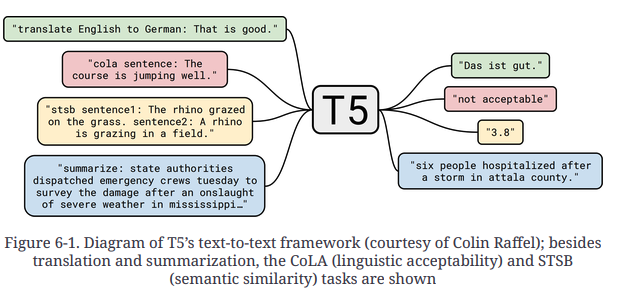

# Summarization

Summarization requires a range of abilites, such as understanding long passages, reasoning about the contens, and producing fluent text that incroprates the main topics from original document. Morever summaraizing a new article is different compared to legal document and each of them requires certain degree of domain generalization. For these reasons summarizing is a difficult task for natural language models, including transformers. Despite these challenges, text summarization has huge applications,

* Helps domain experts to speed up the workflow
* Helps enterprise to summarize contracts, internal knowledge
* Generate content for social media releases and more.

Summarization is a classic sequence-to-sequence(seq2seq) task with an input text and a target text. This is where encoder-decoder transformer excel.

In this notebook we'll cover,

* The challenges involved
* Pretrained transformers to summarize documents, (i.e) our own encoder-decoder model to condense dialouges between several people into a crisp summary.

***Dataset to be used in this notebook*** --> [CNN/DailyMail corpus](https://huggingface.co/datasets/cnn_dailymail)

## Summarization models

#### GPT-2

In [5-text-genreation.ipynb](https://github.com/JpChii/nlp-with-hugging-face/blob/main/notebooks/6_Summarization.ipynb) we checkout how GPT-2 can generate text with some input prompt. Because GPT-2 models are trained on web which includes reddit articles it's good on summarization as well. We can trigger summarization with GPT-2 by appending "TL:DR" at the end of propmt. "TL;DR" is often used to indicate blogs that are too long didn't read to indicate a short version of the long post.

We'll start the summarization experiment by with `pipeline()` from transformers.

#### T5

T5 developers performed a comprehensive study of transfer learning and found they could create a universal transformer by formulating all tasks as text-to-text-tasks.

The T5 checkpoints are pretrained on mixture of unsupervised data(to reconstruct masked words) and supervissed data for several tasks, including summarization. These checkpoints can be directly used for inference using the same prompts used during pretraining. Few input format's as follow,

* To summarize `"Summarize: <ARTICLE>"`
* To translate `translate English to German: <TEXT>`

This capabality makes T5 extremely versatile and with single model we can solve many tasks.

Let's load this and test it out.

*All T5 capabalities*

#### BART

BART also uses an encoder-decoder architecture and is trained to reconstruct corrupted inputs. It combines the pretraining schems of bert and GPT-2. We'll use the `facebook/bart-large-cnn` checkpoint, which has been specifically fine-tuned on CNN/DailyMail dataset

#### PEGASUS

The authors argue that the pretraining objective needs to be closer to the downstream task, the more effective it is.
With summarization as the objective instead of general language modelling, they masked the sentence that contain most of the info of their surrounding paragraphs(using summarizaiton evaluation metrics as a heuristic for content overlap) and pretrained PEGASUS model to reconstruct the senteces to obtain sota model for text summarization.

PEGAUS is an encoder-decoder transformer with it's pretraining objective to predict masked sentences in multisentence texts.

## Measuring the Quality of Generated Text

Good evaluation metrics are important, since we use them to measure the performance of models during training and production. If we've bad metrics then we'll be oblivious to model degradation and if it doesn't align with buisness goals then we might not create any value.

Measuring performance on a text genration task is not as easy as with standard classification tasks such as sentiment analysis or ner. Take an example translating I love dogs to tamil, it can be "enaku nai na romba pudikum" or "nai na enaku usuru". The translation can vary from person to person or by the same person as well in different circumstances. Fortunatley there are alternatives.

Two of the most common metrics to evaluate generated text are BLEU and ROUGE. Let's take a look at how they're defined.

### BLEU

The idea of BLEU is simple, instead of looking at how many are generated tokens are perfectly aligned with reference tokens, we count the number of words or n-grams. We count the number of words available in that occur in reference occurs in generated text and divide it  by the lenght of generation.

There is a problem with this vanilla precision, let's say the generated text has one word from reference text repeated to the length of reference text. Then we'll have perfect precision! For this reason, the authors introduced a small modification: a word is only counted to the equivavlent of the repetitions of the same word in reference text.

Example:

Ref: The cat is on the mat
Gen: the the the the the the

p_vannila = 6 / 6 --> 1.0

p_mode = 2 / 6 --> 0.33

the occurs only twice in reference so 2 is the numerator.

With that simple correction we've a much reasonable value.  

Let's extend this by not only counting single words but n-grams as well. Let *snt* be the generated sentence and *snt'* be the reference sentence. We extract al possible n-grams of degree n and do the count(each discovered n-gram count summed together) to get the precision $p_n$

Also generation count is clipped, meaning occurence count of an n-gram is capped at how many times it occurs in reference sentence. Also sentence is not defined strict and can span multiple sentence and it would be treated as one sentence.

Let's write the equation for $p_n$ from above two points.

$p_n = \frac{∑_{\text{n-gram}\in snt'} Count_{\text{clip}}(n-gram)}{∑_{\text{n-gram}\in snt} Count(n-gram)}$

To put in simple terms, this equation calculates the count of all n-gram's available using the equation and sum them all together.

This equation is for a single sentence, let'x extend the equation for all sentences in corpus C.

$p_n = \frac{\sum_{\text{snt'} \in C}∑_{\text{n-gram}\in snt'} Count_{\text{clip}}(n-gram)}{\sum_{\text{snt} \in C}∑_{\text{n-gram}\in snt} Count(n-gram)}$

Since we are not looking at recall(number of n-grams recalled from reference text), all generated sequences that are short but precise have a benefir compared to sentences that are longer. Therefore precision favours short sentences, to overcome this authors've introduced *brevity penalty*:

Brevity penalty takes a minimum of 1 and exp of (1-ref_len) / (gen_len). When the number of n-gram is lower compared to refrence the exponential will become much smaller and if they are equal it will be exp(0.0) which'll be 1. 

$BR = \min(1, e^{1 - \frac{\ell_{\text{ref}}}{\ell_{\text{gen}}}})$

So why not use something like F1 for recall? With this metric we'll prioritize only the translations with all words in reference text. To avoid that and evlauate all translations equally we'll persist with the combination of $p_n$ with $BR$.

The final BLEU score equation as follows.

$BLEU-N = BR \times \left( \prod_{n=1}^{N} p_n \right)^{\frac{1}{N}}
$

Finally we take the geometric mean of the modified precision up to n-gram N, simply put if N=1 BLEU-N refers to score using indiviudal words if 2 then two words and so on. Generally BLEU-4 is preferred. 

BLEU has number of limitations:
* synonyms are not considered
* In the derivation, most of it seems like ad hoc or rather fragile heuristics. [Evaluating text output in NLP: BLEU risks](https://oreil.ly/nMXRh)
* Expects sentences to be tokenized, if reference and generated text use differnt tokenizer it can lead to varying results. *SacreBLEU* addresses this my internalizing tokenization and is the preferred metroc for benchmarking

Finding ways to overcome these limitations as well as better metrics is still an active area of research.

Haaaa! Enough with the theory, let's calculate some scores. How can we do this, Datasets already has an implementation of this metic sacrebleu. Let's code

### Conclusion for bleu
*Look at the sacrebleu outputs before pointer in [6-summarization.ipynb](../notebooks/6-summarization.ipynb)
> **Pointers**: 
* Smoothing for avoiding score from becoming zero by adding a smooth_value to numerator and denominator, when geneated n-gram is not present in refernce, it will become divide by 0 making the score 0.
* counts, total, precisions are all based on n-grams, 0th index of total(ref) / 0th index of counts(gen) gives 0th index of precision which is bleu-1 ngram score.

The BLEU score is widely used for evaluating machine translations where precise translations are favoured over translations that include all possible words.

For summarization, we want all the important information in the generated text which is opposite of BLEU and favours high recall. This is where the ROUGE score is used.