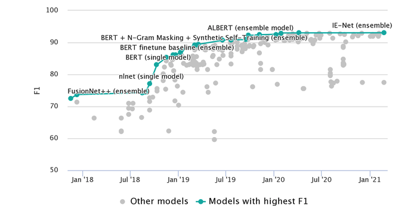
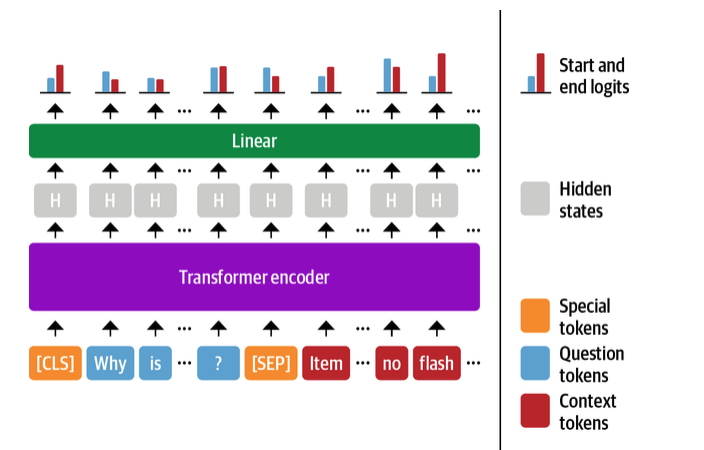
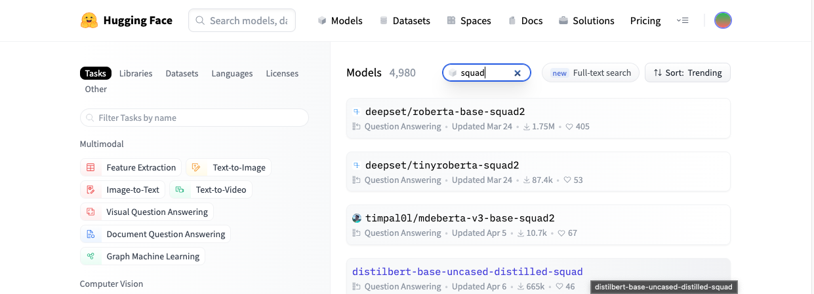
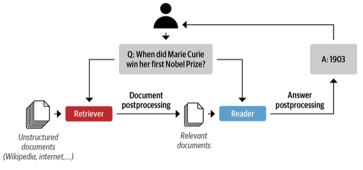

# Question Answering

Irrespective of profession, everyone has to wade through ocean of documents at some point to find the information for their questions.  To make matters worse, we're constantly reminded by search engines there are better ways to search! For instance the earch query "When did Marie Curie win her first Nobel Prize?" And google get the correct answer of "1903".

So how was this search done? Google first retrieved 319,000 documents that were relevant to query, then performed a post processing step to extract the answer snippet with the coressponding passage and web page. But for a more trickier question like "Which guitar tuning is best?" We'll get web pages instead of an answer snippet.

The general approach behind this technology is called *question answering*(QA), but the most common is *extractive QA* which involves questions where answers can be identified as a span in a text document, where the document might be a web page, article, legal document etc.

This two stage process of retrieving relevant documents and then extracting answers from this is the basis of many modern QA systems like semantic search, intellegint assistants and automated information extractors. 

> **Note:** We're covering only extractive QA. There are others,
 * community QA Ex: In stack overflow, all the relevant question answer pairs will be retrived for the new Question from user and then using semantic similarity search to find the closest maching answer to this question.
 * long-form QA, which aims to generate complex paragraph-length answers to open ended questions like "Why sky is blue?"
 * QA can be done over tables as well, and transformer models like TAPAS can even peroform aggregations to produce the final answer!

## Question Answering Dataset history

 The (question, review, [answer setences]) format of SubjQA(used in ) is commonly used in extractive QA datasets and was pioneered in Stanford Question Answering Dataset(SQuAD). 

 * SQuAD is a famous dataset to test the abilit of machines(models) to read a passage of text and answer questions about it
 * This dataset was created from several hundred articles from wikipedia, where each of the article was partioned into paragraphs. Then crowdworkers were asked to generate questions and answers for each paragraph.
 * In the first crowdworkers version of SQuAD, answers for questions were guaranteed to be in paragraphs.
 * Soon sequence to sequence models outperformed humans and predicted spans of answers for question in the context(paragraphs, reviews etc.)
 * SQuAD 2.0 was created by augmenting SQuAD 1.1 with a set of adversial questions that were relevant to the passage but can't be answered from the passage contents alone. This became a better benchmark for evaluation qa capabalities of machines.
 * SOTA models as of 2022 with most models since 2019 surpasses human performance.
    *qa sota models timeline*

    
* However this superhuman performance does not appear to reflect genuine reading comprehension, since answers to these "unanswerable" questions can be found by looking at antonymns in passages. 
* To address these problems Google released the Natural Questions (NQ) dataset which involves fact-seeking questions obtainef from Google Search users.
* The answers in NQ are much longer than in SQuAD and present a more challenging benchmark.

```
NQ >> SQuAD2.0 >> SQuAD
```

### Extracting Answers from Text

The first thing we'll need for our QA systems is to find a way to identify potential answers as span of text in a customer review. To do this, we'll need to understand how to:

1. Frame the supervised learning problem
2. Tokenize and encode text for QA tasks
3. Deal with long passages that exceed a model's maximum context size

#### Frame the problem - span classification

The most common way to extract answers is ny framing the problem as *Span classification task* where start and end tokens acts as lables to be predicted by the model.

*qa span classification*



In general we'll start with a pretrained model and evaluate it on the dataset to use it as a baseline and then fine-tune the model for the use case. But for extractive QA , we can actually start with fine-tuned model because the structure of labels remain the same. Since our training set is realtivley small with only 1,295 samples, A good strategy is to use a model fine-tuned on large-scale QA dataset like SQuAD.

*SQuAD models on hub as of 2nd Sep 2023*



Woah... 4000+ models are available, which model to use depends on mono or multi-lingual and production environment constraints.

*Baseline transformer models fine-tuned on SQuAD 2.0*
| Transformer | Description | Num of Params | F1-Score |
|----------|----------|----------|----------|
| MiniLM   | Distilled version of BERT-base that preserves 99% performance while being twice as fast   | 66M | 79.5 |
| RoBERTa-base | RoBERTa models have better performance than their BERT counterparts and can be fine-tuned on most QA datastes using a single GPU | 125M| 83.0 |
| ALBERT-XXL | SOTA on datasetm but computationally intensive and difficult to deploy | 253M | 88.1 |
| XLM-RoBERTa-large | Multilingual model for 100 languages with strong zero-shot performance | 570M | 83.8 |

### Inputs format

Input format to QA model is 
```
[CLS]question tokens[SEP]context tokens[SEP]
```

### Dealing with long passages

One subtely faced by reading comprehension models is that the context often contains more tokens than the maximum sequence length of the model.

In transformers, we can set `return_overflowing_tokens=True` in the tokenizer to enable the sliding window. The size of the sliding window is controlled by `max_seq_length` argument. and the size of the stride is controlled by `doc_stride`. Let's grab the first example from out training set and define a small window to see how sliding window works...

* The question comes in all the windows
* The first window context spans the length of max_length
* From second window, move back by stride_length from previous window's end token, this is the starting point of curent window and spans the length of max_length. This process is repeated until the sequence ends.
* All the windows overlap with previous window by stride length.


### Using Haystack to Build a QA pipeline

In our example above, we've fed the pipeline or model both question and context. But in reality we'll get only the query from user and we've get the context from our corpus. There are few ways to do it:

#### Simple Approach

Simple and easiest approach is to concatenate all the reviews available as a single context and feed it with question to the model. The bottleneck will be the computation to process, because the context is big due to concatenation. Let's assume it takes 100 milliseconds to process a review with 30 reviews and the model will take 3 seconds latency after users input which won't work in an ecommerece application.

To overcome this, moder QA system uses retriever-reader approach:

#### Retriever-Reader architecture

##### Retriever

Retriever is responsible for retrieving relevant documents for the user query. They are categorized as sparse and dense

1. *Sparse Retrievers*: This uses word frequencies to represent a document. The query is also a sparse vector. The relevancy of document for the query is determined by computing an inner product of both vectors.
2. *Dense Retrievers*: This stores documents as contextualized embeddings. The query is converted into a dense vector using encoder like transformers. Then both query and documents are compared, semantic meaning is available with embeddings. This allows for a more accurate search of documents by understanding the content of the query.

##### Reader

Responsible for extracting an answer from the documnts provided by the retriver. These can be reading comprehension models(extract answers from text) or free-form answers from generative tranformers.

There can be post-processing after retriver or reader and both as well. Like ranking the documents from retriever to remove noisy passages or postprocessing answer by combining answer from various passages in a long document.

*Modern qa architecure*:



To buld our QA system, we'll use the [Haystack library](https://haystack.deepset.ai/) developed by [deepset](https://deepset.ai/). Haystack is based on retriever-reader architecure and tighty coupled with transformers to abstract away the complexity in building these systems.

In addition to retriever and reader an QA system requries two more components:

##### Document store

A document-oriented database that stors documents and metadata which are provided to the retriever at query time

##### Pipeline

Combines all the components of QA system to enable custom query flows, merging documents from multiple retrievers and more.

Next we'll explore how to build a prototype popeline and then focus on improving it's performance.

For an implementation of document store, retriever, reader refer the respective notebook.

## Improving QA Pipeline

> **Note:** Irrespective of recent research on QA has focused on readin comprehnsion models, the performance of QA will be bad if the retriever can't find the relevant documents for the query. Retriever set's an upper bound on the performance of reader(reading comprehension models). With this in mind let's look at some common metrics to evaluate the retriever so that we can compare the performance of sparse and dense representations.

For developing a good QA system, we can go throught the below steps,

* Evaluate the retriever(pretrained on a dataset)
* Evaluate the reader(pretrained on a dataset)
* Check if the metrics and results are good
* If not, perform a domain adaptation of reader and retriever on the dataset.

All the above steps can be performed with reader retriever `eval()` and `train()` function from hasytack for extractive QA with metrics(EM and F1).

### Evaluating the Retriever

A common metric for evaluating the retriever is *recall*, which measure the fraction of all relevant documents that can be retrieved. Here relevant mean the number of top_k documents retrieved has the answer in them. This can be computed by counting the number of times an answer occurs in the top_k documents.

10 top_k documents, answer appers in 8 of them, recall will be 80%.

In Haystackm there are two ways to evaluate retrievers:

* Retrievers built in `eval()` method. This can be used for both open and closed-domain QA. But for dataset like QA where each document is paired with a product and needs to be filterd by Product id for every query.

### Evaluating the Reader

In extractive QA, there are two main metrics that are used for evaluating the reader:

*Exact Match (EM)*

A binary metric that gives EM=1 if the characters in the predicted and ground truth match exactly and EM=0 otherwise. If no answer is expected, the model gets EM=0 if it predicts any text all.

*F1-score*

Harmonic mean of precision and recall.

Let's see how these metrics wit some helper functions from FARM over a simple example.