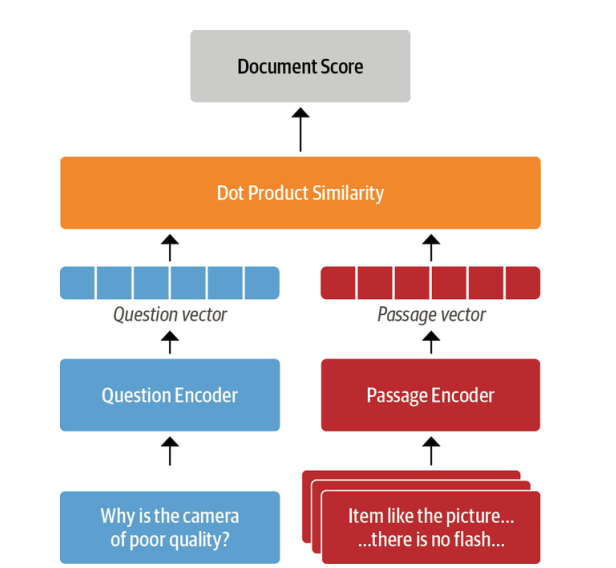

# Question Answering

[Source notebook](../notebooks/7-question-answering.ipynb)

Irrespective of profession, everyone has to wade through ocean of documents at some point to find the information for their questions.  To make matters worse, we're constantly reminded by search engines there are better ways to search! For instance the each query "When did Marie Curie win her first Nobel Prize?" And google get the correct answer of "1903".

So how was this search done? Google first retrieved 319,000 documents that were relevant to query, then performed a post processing step to extract the answer snippet with the coressponding passage and web page. But for a more trickier question like "Which guitar tuning is best?" We'll get web pages instead of an answer snippet.

The general approach behind this technology is called *question answering*(QA), but the most common is *extractive QA* which involves questions where answers can be identified as a span in a text document, where the document might be a web page, article, legal document etc.

This two stage process of retrieving relevant documents and then extracting answers from them. This is the basis of many modern QA systems like semantic search, intelligent assistants and automated information extractors. 

> **Note:** We're covering only extractive QA. There are others,
 * community QA Ex: In stack overflow, all the relevant question answer pairs will be retrived for the new Question from user and then using semantic similarity search to find the closest maching answer to this question.
 * long-form QA, which aims to generate complex paragraph-length answers to open ended questions like "Why sky is blue?"
 * QA can be done over tables as well, and transformer models like TAPAS can even peroform aggregations to produce the final answer!

## Question Answering Dataset history

 The (question, review, [answer setences]) format of SubjQA(used in [7-question-answering.ipynb notebook usecase for qa](../notebooks/7-question-answering.ipynb)) is commonly used in extractive QA datasets and was pioneered in Stanford Question Answering Dataset(SQuAD). 

 * SQuAD is a famous dataset to test the ability of machines(models) to read a passage of text and answer questions about it.
 * This dataset was created from several hundred articles from wikipedia, where each of the article was partioned into paragraphs. Then crowdworkers were asked to generate questions and answers for each paragraph.
 * In the first crowdworkers version of SQuAD, answers for questions were guaranteed to be in paragraphs.
 * Soon sequence to sequence models outperformed humans and predicted spans of answers for question in the context(paragraphs, reviews etc.)
 * SQuAD 2.0 was created by augmenting SQuAD 1.1 with a set of adversial questions that were relevant to the passage but can't be answered from the passage contents alone. This became a better benchmark for evaluation qa capabalities of machines.
 * SOTA models as of 2022 with most models since 2019 surpasses human performance.
    *qa sota models timeline*

    
* However this superhuman performance does not appear to reflect genuine reading comprehension, since answers to these "unanswerable" questions can be found by looking at antonymns in passages. 
* To address these problems Google released the Natural Questions (NQ) dataset which involves fact-seeking questions obtained from Google Search users.
* The answers in NQ are much longer than in SQuAD and present a more challenging benchmark.

```
NQ >> SQuAD2.0 >> SQuAD
```

### Extracting Answers from Text

The first thing we'll need for our QA systems is to find a way to identify potential answers as span of text in a customer review. To do this, we'll need to understand how to:

1. Frame the supervised learning problem
2. Tokenize and encode text for QA tasks
3. Deal with long passages that exceed a model's maximum context size

#### Frame the problem - span classification

The most common way to extract answers is by framing the problem as *Span classification task* where start and end tokens acts as lables to be predicted by the model.

*qa span classification*


In general we'll start with a pretrained model and evaluate it on the dataset to use it as a baseline and then fine-tune the model for the use case. But for extractive QA , we can actually start with fine-tuned model because the structure of labels remain the same. Since our training set is realtivley small with only 1,295 samples, A good strategy is to use a model fine-tuned on large-scale QA dataset like SQuAD.

*SQuAD models on hub as of 2nd Sep 2023*


Woah... 4000+ models are available, which model to use depends on mono or multi-lingual and production environment constraints.

*Baseline transformer models fine-tuned on SQuAD 2.0*
| Transformer | Description | Num of Params | F1-Score |
|----------|----------|----------|----------|
| MiniLM   | Distilled version of BERT-base that preserves 99% performance while being twice as fast   | 66M | 79.5 |
| RoBERTa-base | RoBERTa models have better performance than their BERT counterparts and can be fine-tuned on most QA datastes using a single GPU | 125M| 83.0 |
| ALBERT-XXL | SOTA on dataset but computationally intensive and difficult to deploy | 253M | 88.1 |
| XLM-RoBERTa-large | Multilingual model for 100 languages with strong zero-shot performance | 570M | 83.8 |

### Inputs format

Input format to QA model is 
```
[CLS]question tokens[SEP]context tokens[SEP]
```

### Dealing with long passages

One subtely faced by reading comprehension models is that the context often contains more tokens than the maximum sequence length of the model.

In transformers, we can set `return_overflowing_tokens=True` in the tokenizer to enable the sliding window. The size of the sliding window is controlled by `max_seq_length` argument. and the size of the stride is controlled by `doc_stride`. Let's grab the first example from out training set and define a small window to see how sliding window works...

* The question comes in all the windows
* The first window context spans the length of max_length
* From second window, move back by stride_length from previous window's end token, this is the starting point of curent window and spans the length of max_length. This process is repeated until the sequence ends.
* All the windows overlap with previous window by stride length.

*How does the sliding window data goes into model, how the predictions are post processed to get answers? -> [refer this](https://github.com/huggingface/notebooks/blob/main/examples/question_answering.ipynb)*


## Using Haystack to Build a QA pipeline

In our example above, we've fed the pipeline or model both question and context. But in reality we'll get only the query from user and we've get the context from our corpus. There are few ways to do it:

### Simple Approach

Simple and easiest approach is to concatenate all the reviews available as a single context and feed it with question to the model. The bottleneck will be the computation to process, because the context is big due to concatenation. Let's assume it takes 100 milliseconds to process a review with 30 reviews and the model will take 3 seconds latency after users input which won't work in an ecommerece application.

To overcome this, modern QA system uses retriever-reader approach:

### Retriever-Reader architecture

#### Retriever

Retriever is responsible for retrieving relevant documents for the user query. They are categorized as sparse and dense

1. *Sparse Retrievers*: This uses word frequencies to represent a document. The query is also a sparse vector. The relevancy of document for the query is determined by computing an inner product of both vectors.
2. *Dense Retrievers*: This stores documents as contextualized embeddings. The query is converted into a dense vector using encoder like transformers. Then both query and documents are compared, semantic meaning is available with embeddings. This allows for a more accurate search of documents by understanding the content of the query.

#### Reader

Responsible for extracting an answer from the documents provided by the retriver. These can be reading comprehension models(extract answers from text) or free-form answers from generative tranformers.

There can be post-processing after retriver or reader and both as well. Like ranking the documents from retriever to remove noisy passages or postprocessing answer by combining answer from various passages in a long document.

*Modern qa architecure*:


To build our QA system, we'll use the [Haystack library](https://haystack.deepset.ai/) developed by [deepset](https://deepset.ai/). Haystack is based on retriever-reader architecure and tighty coupled with transformers to abstract away the complexity in building these systems.

In addition to retriever and reader an QA system requires two more components:

#### Document store

A document-oriented database that stores documents and metadata which are provided to the retriever at query time

#### Pipeline

Combines all the components of QA system to enable custom query flows, merging documents from multiple retrievers and more.

Next we'll explore how to build a prototype popeline and then focus on improving it's performance.

For an implementation of document store, retriever, reader refer the respective notebook.

### Implementation of QA Pipeline with haystack

#### Initializing elastic search document store

Other document stores:
1. Memory
2. FAISS
3. Pinecone
4. All other document databases like mongo etc

To initialize a elastic search document store, we've to setup our elastic search instance and running. Once it's up we can initialize the `ElasticSearchDocumentStore` from `haystack.document_stores.elasticsearch` by passing elastic search instance details. 

This initialization creates two indices: `documents`, `labels` to ingest documents and answer spans in respective indices. Haystack Document stores expect a list of dictionaries. Dict format requires: 
    1. text - document or string or context
    2. meta - a dict with other sub keys for filtering the documents(if required)

After creating data in this format, we can ingest them into document store using :
```Python
document_store.write_documents(
    documents=docs, index="document"
)
```

[Alternate way to ingest files directly is to use haystack pipelines(use components like converter, splitter, embedder, writer) to directly write txt files to index.](https://haystack.deepset.ai/integrations/elasticsearch-document-store)

#### Initializing a retriever

We can intialize BM25(spare) retriever by Initializing the `haystack.nodes.retriever.BM25Retriever` by passing the document_store object initialized above.

[BM25 algorithm in elastic search](https://www.elastic.co/blog/practical-bm25-part-2-the-bm25-algorithm-and-its-variables)

```Python
from haystack.nodes.retriever import BM25Retriever
bm25_retriever = BM25Retriever(document_store=document_store)
```

To retrieve documents using the retriever, we can pass below parameters:
    1. query(required) - user query
    2. filters(optional) - to restrict the search of documents using metadata
    3. top_k (options, but preferred) - to fetch top-k documents from document store based on query

```Python
item_id = "B0074BW614"
query = "Is it good for reading"
retrieved_docs = bm25_retriever.retrieve(
    query=query,
    top_k=3,
    filters={
        "item_id":[item_id],
        "split": ["train"],
    }
)
```

The output is a list of `Document` objects with Lucence score. This is score of both query and fetched documents using [Lucene's practical scoring algorithm](https://www.elastic.co/guide/en/elasticsearch/guide/current/practical-scoring-function.html).

* BM25 to fetch documents based on query, and above scoring to calculate a similarity score between query and documents.
* BM25 intuitivley uses words from user query with documents to calculate the score to fetch documents from document store.

#### Initializing the reader

We can use FARMReader from haystack or TrasformersReader from huggingface.


#### FARMReader

Based on deepset's [FARM framework](https://farm.deepset.ai/) for fine-tuning and deploying transformers. Compatible with models trained using Transformers and can load models directly from the Hugging Face Hub

#### TransformersReader

Based on the QA pipeline from Transformers suitable for running inference only.

#### FARMReader vs TransformerReader

The handling of weights are same in the readers, but there are some differences listed below,

* `TransformersReader` normalizer answers from a passage using softmax. After normalization comparing scores of answers from different passages doesn't make sense, as normalization is done based on answers in a single passage and comparison becomes irrelevant. FARM doesn't normalize the logits and inter-passage answers can be compared more easily.
* `FARMReader` predicts same answers twice with different scores, when answer lies in two overlapping windows in a long context. In FARM these duplicates are removed.

Since we'll be fine-tuning the reader later, we'll use the `FARMReader`. As with transformers we just need to specify the MiniLM checkpoint with some QA-specific arguments to initalize the reader with FARM.

With FARMReader, we've to specify:
    1. model_name
    2. max_seq_length
    3. doc_stride

The FARMReader also uses same parameters as tokenizers to control the sliding window.

We can get answers with reader like below:

```Python
reader.predict_on_texts(
        question=question,
        texts=[context],
        top_k=1
    )
```

#### Putting reader and retriever together

Haystack has pipelines analagous to transformers to tie up reader and retriever together in a pipeline, but these are specialized for QA.

We can also pass top_k parameters to Reader and retriever to this pipeline.

ExtractiveQA Pipeline intialization and call below:
```Python
# Pipeline initialization
from haystack.pipelines import ExtractiveQAPipeline

pipe = ExtractiveQAPipeline(
    reader=reader,
    retriever=bm25_retriever,
)

# Pipeline Call
n_answers = 3
preds = pipe.run(
    query=query,
    params={
        "Retriever": {
            "top_k": 3,
            "filters": {
                "item_id": [item_id],
                "split": ["train"]
            }
        },
        "Reader": {
            "top_k": n_answers
            }
        }
)
```

The output also has lots of fields.

## Improving QA Pipeline

> **Note:** Irrespective of recent research on QA has focused on reading comprehnsion models, the performance of QA will be bad if the retriever can't find the relevant documents for the query. Retriever set's an upper bound on the performance of reader(reading comprehension models). With this in mind let's look at some common metrics to evaluate the retriever so that we can compare the performance of sparse and dense representations.

> If retriever performance is bad it's like searching answers for physics question in chemistry book.

For developing a good QA system, we can go throught the below steps,

* Evaluate the retriever(pretrained on a dataset)
* Evaluate the reader(pretrained on a dataset)
* Check if the metrics and results are good
* If not, perform a domain adaptation of reader and retriever on the dataset.

All the above steps can be performed with reader retriever `eval()` and `train()` function from hasytack for extractive QA with metrics(EM and F1).

### Evaluating the Retriever

A common metric for evaluating the retriever is *recall*, which measure the fraction of all relevant documents that can be retrieved. Here relevant mean the number of top_k documents retrieved has the answer in them. This can be computed by counting the number of times an answer occurs in the top_k documents.

10 top_k documents, answer appers in 8 of them, recall will be 80%.

In Haystack there are two ways to evaluate retrievers:

* Pipelines built in `eval()` method. This can be used for both open and closed-domain QA. But for dataset like QA where each document is paired with a product and needs to be filterd by Product id for every query.

To call this method:
    1. We've to add questions, answers using `Label` object
    2. Add them to `label` index
    3. Aggregate the labels based on question or question id or meta field to aggreate
    4. Then call eval with aggregated labels and retriever params

Increasing top_k will improve recall, but increase the compute as well. We've to evaluate the retriever for different k values.

`eval_result` of `eval()` call has `calculate_metrics()`, we can feed this `simulated_top_k_retriever` value to evaluate eval results for different top_k values.

Code walkthrough for evaluation is in source notebook.

* The above top_k evaluation is mainly used for BM25 retriever, which requires more documents to get better results. Due to it's nature of fetching documents from document store using words from query.

#### Dense Passage Retriever

Is there a way to reduce k, which will reduce latency of overall QA pipeline. One known disadvantage of sparse retrievers is it's inability to retrieve documents from query words. As an alternative, we can use dense representation to retrieve documents using query.

##### DPR model

Dense passage retriever model is a bi-encoder model to obtain a good score between query and passages. Out of two encoders, one is for query and another one is for passage. The training setup to reduce the loss(negative log likelyhood score for positive passages) can be used to learn embeddings to group questions and passages together in embedding dimension.

Refer section 3.2 in paper for training objective.

[Dense Passage Retrieval for Open-Domain Question Answering](https://arxiv.org/pdf/2004.04906.pdf)

DPR uses BERT model for both the encoders and uses less question and passage pairs.



#### Intializing DPR retriever

We can intialize a dpr retriever with below params:
    1. Document_store
    2. Query encoder model
    3. Passage encoder model

```Python
from haystack.nodes import DensePassageRetriever

dpr_retriever = DensePassageRetriever(
    document_store=document_store,
    query_embedding_model="facebook/dpr-question_encoder-single-nq-base",
    passage_embedding_model="facebook/dpr-ctx_encoder-single-nq-base",
    embed_title=False,
)
```

Later we can create embeddings for query and passage using respective models, via below code:
 
```Python
document_store.update_embeddings(
    retriever=dpr_retriever,
)
```

We can use the same evaluation setup as BM25 to evaluate the retriever for different k values.

We can even fine-tune dpr models for a domain usinf Facebook's FAISS library.

### Evaluating the Reader

In extractive QA, there are two main metrics that are used for evaluating the reader:

*Exact Match (EM)*

A binary metric that gives EM=1 if the characters in the predicted and ground truth match exactly and EM=0 otherwise. If no answer is expected, the model gets EM=0 if it predicts any text all.

*F1-score*

Harmonic mean of precision and recall.

Let's see how these metrics wit some helper functions from FARM over a simple example.

We can use `compute_f1`, `compute_exact` from `haystack.modeling.evaluation.squad` to calculate these metrics.

Under the hood, the prediction words are normalized(removed punctuations, fixing whitespace, lowercase). Then converting it to bag-of-words and calculate score at the token level.

*How the score is calculated for multiple question answer pair?*

* First the score is calculated for multiple answers paired with a question
* Then the answer with highest score is selected over all possible answers
* Finally average of the indiviual score is calculated to get the final score.


The evaluation of reader is done by creating a pipeine that consists of a single node, reader in this case. Then `eval()` to evaluate the reader with labels index.

```Python
from haystack.pipelines import Pipeline
def evaluate_reader(reader):
    score_keys = ['exact_match', 'f1']
    p = Pipeline()
    p.add_node(
        component=reader,
        name="Reader",
        inputs=["Query"],
    )
    eval_result = p.eval(
        labels=labels_agg,
        documents=[[label.document for label in multilabel.labels] for multilabel in labels_agg],
        params={},
    )
    metrics = eval_result.calculate_metrics(simulated_top_k_reader=1)
    return {k:v for k,v in metrics["Reader"].items() if k in score_keys}

reader_eval = {}
reader_eval["Fine-tune on SQuAD"] = evaluate_reader(reader)
```

If the results are still bad, the dataset used for pretraining on off the shelf qa model is different from the domain used. In this case we've to perform domain adaptation or fine-tune the model on our dataset.
For this we can use haystack reader's train and save method to fine tune and save the model.

* Finetuning with haystack codebase is available in notebook
* [Finetuning with transformers based on paper is available here, Warning: implementation looks good but not yet tested](https://colab.research.google.com/drive/1dv3DE4Lp39T6F3fI466iZLdtZfpyTXHI?usp=sharing#scrollTo=V7YcIJwYCOEe)

We've to reformat the input data to pretraining format used by the model.

### Evaluating QA pipeline

We can evaluate the entire pipeline in the same way like reader and retriever.

```Python
# Evaluation setup
from haystack.pipelines import ExtractiveQAPipeline
pipe = ExtractiveQAPipeline(
    retriever=bm25_retriever,
    reader=reader,
)

# Evaluate
eval_result = pipe.eval(
    labels=labels_agg,
    params={},
)
metrics = eval_result.calculate_metrics(
    simulated_top_k_reader=1,
)
reader_eval["QA Pipeline (top-1)"] ={
    k:v for k,v in metrics["Reader"].items()
    if k in ["exact_match", "f1"]
}

# Getting metrics
# Or get QA pipeline and Reader metrics in one shot:
# Reader evaluation is run a second time using simulated perfect retriever results
eval_result = pipe.eval(
    labels=labels_agg,
    params={},
    add_isolated_node_eval=True
)
metrics = eval_result.calculate_metrics(simulated_top_k_reader=1)
# Extract metrics from reader run in isolation with simulated perfect retriever
isolated_metrics = eval_result.calculate_metrics(simulated_top_k_reader=1, eval_mode="isolated")

pipeline_reader_eval = {}
pipeline_reader_eval["Reader"] = {
    k:v for k,v in isolated_metrics["Reader"].items()
    if k in ["exact_match", "f1"]}
pipeline_reader_eval["QA Pipeline (top-1)"] = {
    k:v for k,v in metrics["Reader"].items()
    if k in ["exact_match", "f1"]}

plot_reader_eval(pipeline_reader_eval)
```

## RAG

### Going Beyond Extractive QA

One interesting alternative to extracting spans of answers of text in a document is to generate them with a pretrained language model. This approach is called *abstractive or generative QA* and has the potential to produce better phrased answers than answers synthesized from mutliple passages. We'll breifly toucj on the current state of art: *retrieval-augmented generation* (RAG).

RAG extends the retriever-reader architecture by replacing the reader with genereator and DPR as the retriever. The generator is a pretrained sequence-to-sequence transformer like T5 or BART that reciever latent vectors of documents from DPR then iterativley generates an anser based on the query and these documents.

There are two types of generator or RAG models:

*RAG-Sequence*:
Uses the same retrieved document to generate an complete answer. In particular, the top k documents are fed to the generator, which produces and output for each document, and the result is marginalized to obtain the best answer.

*RAG-token*:
Uses different documents to generate each token in the answer. This allows the generator to synthesize evidence from multiple documents.

We'll use RAG-Token models as they have better performance than RAG-Sequence ones. We'll instatiate the generator from hasytack with a different set of params.

# Quick Notes:

QA models are reading comprehension models, which needs to understand the context, question to identify the span(extractive qa) answers in context or geneate answers(long from qa) answers based on context, grounded in context.

In general QA models can be classified based on the domain:
    * If it's for a single product, less documents to retrive. This is called Narrow QA
    * If it's for all kinds of products(amazon,flipkart), more documents to retrieve. This is called Open QA.

Based on machine learning problem:
    * Span classification - Extrative QA
    * Text generation - Long form QA

Community QA belongs to both of these.

There are few benchmark datasets for QA models. They are:
    1. NQ by google
    2. SQUAD 1.1
    3. SQUAS 2.0

*QA system:*

The QA models require context and question to predict results.

Query comes from user, where does the context comes from? This should be from our corpus.

*Is it okay to use the entire corpus as context:*
    If it's like 5 documents then it's fine. What if we've thousands or millions of documents?

    Using all of them and feeding it to model, the prediction will take a long time. Will the user be patient enough for such a long time? NO, so we need a retriever system to retrieve documents or articles or web pages from our corpus based on the user query.

    The retrieval can be based on metadata filtering like:
        1. domain
        2. product
        3. keywords

    Or based on semantic similarity of query with context. This can be built using a retriever model. Check the semantic representations, similarity scores between queries and context before this approach. This is our vector store or document store to retrieve documents based on the query.

    There are different types of retrievrs available.

*Data EDA:*

* visualize the dataset
* understand how context, question, answer, span is defined
* Explore how many context starts with regular question words like what, how, when etc? To get an idea of the data
* Explore the tokenized input length

*Modelling:*

Output of a extractive qa model:

* The last layer of extractive qa model[tinyroberta, minilm from deepset] is linear layer with two logits. This is fit into QuestionAnsweringOutput class and returned.
* In a way this is also like a token classification task. But here we are classifying span tokens. 
* We've logits for start and end span tokens based on hidden states. This spans the length of input tokens.
* logits_length == input_tokens_length

* After getting the start and end logits, we can do a simple argmax to get the span tokens positions. This heuristic approach has some disadvantages:
    1. This doesn't verify if the spans are coming in question itself
    2. If end spand comes before start span
    3. If the answer is grounded in context or not

All these limitations are handled in `question-answering` pipeline.

We can fine-tune a model and use the pipeline for these sophistications or write them ourselves.

* visualize span logits for a few samples for getting an intution