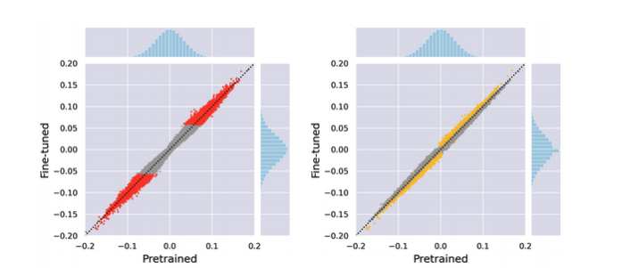
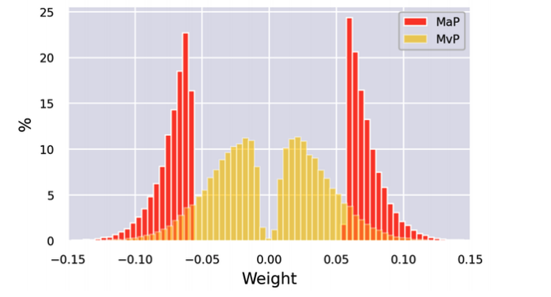

# Making Transformers Efficient in Production

In previous notebooks, we've seen how transformers can be fine-tuned for various tasks. However in many situations irrespective of the metric, model is not very useful if it's too slow or too large to meet the buisness requirements of the application. The obvious alternative is to train a faster and more compact model, but with reduction comes the degradation in performance. What if we need a compact yet highly accurate model?

In this notebook we'll cover four techniques with Open Neural Network Exchange(ONNX) and ONNX Runtime(ORT) to reduce the prediction time and memory footprint of the transformers, they are:

  1. *Knowledge distillization*
  2. *Quantization*
  3. *Pruning*
  4. *Graph Optimization*

We'll also see how the techniques can be combined to produce significant performance gains. [How Roblox engineering team scaled Bert to serve 1+ Billion Daily Requests on CPUs](https://medium.com/@quocnle/how-we-scaled-bert-to-serve-1-billion-daily-requests-on-cpus-d99be090db26) and found that knowledge distillization and quantization improved the latency and throughput of their BERT classifier over a factor of 30!

To illustrate the benefits and tradeoffs associated with each technique, we'll use intent detection(important component of text-based assistants), where low latency is critical for maintaining a conversation in real time.
Along the way, we'll also learn how to create custom trainers and perform hyperparamter search, and gain a sense of what it takes to implement cutting-edge research with Transformers(lib).

## Creating a Performance Benchmark

Like other machine learning models, deploying transformers in production environments involves trade-off among several constraints, the most common being:

*Model Performance*

How well does our model perform on a well-crafted test set that reflects production data? This is especially important when the cost of making erros is large(and best mitigated with a human in the loop) or running inference on millions of examples and small improvements to the model metrics can translate into large gains in aggregate.

*Latency*

How fast can our model deliver predictions? We usually care about latency in a real-time environment where we deail with a lot of traffic, like how stack overfloww needed a classifier to quickly [detect unwelcome comments on the website](https://stackoverflow.blog/2020/04/09/the-unfriendly-robot-automatically-flagging-unwelcoming-comments/)

*Memory*

How can we deploy billion-parameter models like GPT or T5 which requires gigabytes of disk storage and RAM? Memory plays an important role in mobile and edge devices, where we've to generate predictions without a cloud server.

Failing to address these constrains might result in:

* Poor user experience
* Balooned cloud costs for just a few user requests

To explore how the 4 different compression techniques can be used to optimizer these. Let's create a benchmark class which measures each of these quantities for a given pipeline and a test set.

## Making Models Smaller Via Knowledge Distillation

Knowledge Distilliation is a general-purpose technique to train a smaller *student* to mimic the larger *teacher* model. This was introduced in 2006 for ensemble models then popularized in 2015 for deep learning and applied to image classification and speech recognition.

With the increase in parameters with pretrained models(trillions and more), Knowledge distillation is a compression technique to compress these models and build practical applications.

### Knowledge Distillation for Fine-Tuning

#### Intution
How is knowledge distilled or transferred from teacher to student. In Fine-tuning the main idea is to augment(extend) the logits to soft probabalities. With soft probabalities we'll get probabality distribution(ex higher probablity for two intents) or information that is not accessible from labels alone. By training the student to mimic these probabalities we distill the information to the student.

#### Mathametical perspective

* We feed an input sequence X to the teacher to generate a vector of logits z(x) = [z_1(x), ..., z_N(x)]. We can convert these logits to probabalities with softmax function:

$\text{softmax}(z(x)) = \frac{\exp(z_i(x))}{\sum_{j=1}^N \exp(z_j(x))}$

* But with this softmax, we'll mostly get a single highest probability for an intent and others close to zero. With this the student can'e learn anything from truth labels.
* To soften the probabalities we'll use the hyperparameter T before applying the softmax

${p_i(x)} = \frac{\exp\left(\frac{z_i(x)}{T}\right)}{\sum_{j=1}^N \exp\left(\frac{z_j(x)}{T}\right)}$

when T=1 we recover the original softmax distribution.

*hard-vs-soft softmax distribution*


What's the difference between teacher and student softened probabalies?

* We can calculate this with [Kullback Leibler (KL)](https://en.wikipedia.org/wiki/Kullback%E2%80%93Leibler_divergence) divergence to measure the differnce between two probabalities.

$D_{\text{KL}}(p, q) = \sum_i p_i(x) \log \left(\frac{p_i(x)}{q_i(x)}\right)$

The divergence increase when the differnce in loss is large.

* We can calculate how much is lost when we approximate the probabality distribution of studfen with the teacher. This is knowledge Distillation loss. Here we include $T^2$ because before softmax we divide the logits by T in numerator and denominator of softmax. Product of $T^2$ and KL divergence gives the loss.

$L_{\text{KD}} = T^2 \cdot D_{\text{KL}}$

* $T^2$ is the normalization factor to account for the magnitude of the gradients produced by soft label scales as 1/$T^2$.
* For classification tasks, the student loss is then a weighted average of the distillation loss with the usual cross-entropy loss $L_{\text{CE}}$ of the ground truth labels. We use a hyperparameter $\alpha$ to control control the relative strength of the losses.

$L_{\text{student}} = \alpha L_{\text{CE}} + (1 - \alpha) L_{\text{KD}}$

*Knowledge distillation process*


### Knowledge Distillation for Pretraining

Knowledge distillation can also be used during pretraining to create a general-purpose student that can be subsequently fine-tuned on downstream tasks. In this case Masked Language Modelling Knowledge of BERT is transferred to the student. For example, in [DistilBERT paper](https://arxiv.org/abs/1910.01108) mlm loss is augmented with a term from knowledge distillation and a cosine embedding loss to align the directions of the hidden state vectors between the teacher and student.

$L_{\text{cos}} = 1 - \cos(h_s, h_t)$

$L_{\text{DistilBERT}} = \alpha L_{\text{mlm}} + \beta L_{\text{KD}} + \gamma L_{\text{cos}}$

We already have a fine-tuned BERT model, let's use knowledge distillation to fine-tune a smaller and faster model. For this we;ve to augment the cross entropy loss with $L_{\text{KD}}$. We can do this by creating our own trainer.

## Making Models Faster with Quantization

Knowledge distillation reduces the computational and memory needs by training a student model to mimic the teacher. Quantzation reduces the computational memory by reducing the data type to lower level precision like 8-bit integer (INT8) instead of 32-bit floating point. With reductuion in data types, memory storage for computations and matrix multiplication is reduced with not much loss in accuracy!

### A Primer on Floating-point and Fixed-point numbers

Most transformers today are pretrained with floating-point numbers(FP-16 or FP-32), since the provide the precision to accomodate the wide range of weights, activations and gradients. A floating-point number like FP32 represents a sequence of 32 bits grouped as sign, exponent and significand.

* sign - determines whether the number is positive or not
* significant - corresponds to the number of significant digits scaled to exponent in some fixed base(usually 2 for binary and 10 for decimal).

```Python
# Example
# Decimal
decimal = 137.035
# Floating-point32
fp32 = (-1)**0 * 1.37035 * 10**2
decimal, fp32, decimal == fp32
```

In this:
* significand - 1.3705
* exponent - 10**2 in base 10
* sign - (-1)**0

Through the exponent we can represent a wide range of real numbers, and the decimal or floating point can be place anywhere relative to the significant digits(hence the name floating-point).

> **Note:**
  1. Low-precison data types allocate fewer bits.
  2. Fixed-point format uses less memory than floating-point. It's predetermined and fixed.

However, once the model is trained,we only need the forward pass to run inference, so we can reduce the precision of the data types without impacting the accuracy too much. For neural networks it is common to use a *fixed-point format* for the low-precision data types, where
* real numbers are represent as B-bit integers that are scaled by a common factor for all variables of the same type.
* We can control the range and precision of the fixed point number by controlling this scaling factor.

The basic idea behing quantization is that we can `discretize` the floating-point values *f* in each tensor by mapping their range $[f_{\text{max}}, f_{\text{min}}]$ into a smaller one $[q_{\text{max}}, q_{\text{min}}]$ of fixed-point numbers *q*, and linearly distributing all the values in between. Mathametically, this mapping is described by the following equation:

$f = \left(\frac{{f_{\text{max}} - f_{\text{min}}}}{{q_{\text{max}} - q_{\text{min}}}}\right) (q - Z) = S(q - Z)$

where S is a positive floating-point number and the constant Z is the offset and has the same type as q. Z is called the *zero point* because it corresponds to the quantized value of the floating-point value f = 0. Note that the map needs to be *affine* to get the floating-point number when we dequantize the fixed-point ones.

*Quantization of fp to 8-bit int by Manas Sahni*


One of the main reasons transformers are prime candidates for quantization is the weights and activations range are quite small. We don't have to fit the entire FP32 numbers into 2**8 = 256 numbers represented by INT8. To see this, let's pick out one of the attention weight matrices from our distilled model and plot the frequency distribution of the values.

For a full-scale transformer, the actual compression rate depends on which layers are quantized.

Changing the precision for all computations in our model introduces small disturbances at each point in the computational graph, which can compound and affect model's performance. There are several ways to quantize a model. For deep neural networks, there are three main approaches:

#### Dynamic Quantization

With dynamic quantization nothing is changed during training and all weights are changed to INT8 ahead of inference time. In addition activation are also quantized. This is dynamic because quantization happens on the fly. One bottleneck is writing and reading from floating-point. This is the simplest quantization technique.

#### Static Quantization

Insted of computing the quantization of the activations on the fly, we can avoid the conversion of floating-point by precoomputing the quantization scheme. How is this done? We pass representative sample of data ahead of inference time and observe the activation patterns and then calculate, save the ideal quantization scheme. This enabels us to skip the conversion between INT8 and FP32 conversions. But this adds another additional step to the pipeline, as we need access to good data sample plus we need to find a good quantization scheme before inference. Static quantization does not account for difference in precision during training and inference, which leads to a performance drop in the model's metrics(e.g. accuracy).

#### Quantization-aware training

The effect of quantization can be "faked" during training by rounding of FP32 values during forward and backward pass. This improves performance in terms of model metrics over static and dynamic quantization.

The main bottleneck for running inference with transofrmers is the compute and memory bandwidth associated with the enormous numbers of weights in these models, so dynamic quantization is the current best approach for transformer-based models in NLP. In smaller computer vision model static quanitzation is generally used.

Also only lineart layers are quantized.

## Optimizing Inference with ONNX and the ONNX Runtime

ONNX is an open standard that defines a common set of operators to export models as a computational graph that represents flow of data thorugh network. It's also a common file format to represent deep learning models ina variety of frameworks including PyTorch, TensorFlow.

An example below, a section of the ONNX graph for BERT-base, visualized in Netron:


By exposing a graph with standardized operators and data types, ONNX makes it easy to swtich between frameworks. For ex, a model trained in PyTorch can be exported to ONNX format and then imported in TensorFlow(and vice versa).

Where ONNX really shines is when it is coupled with a dedicated accelerator like ONNX Runtime, or ORT for short. ORT uses techniques like operator fusion and constant folding to optimize the ONNX graph, and defines an interface to *execution providers* that allows to run the model on different types of hardware. Below figures shows the high level architecture of the ONNX and ORT ecosystem:


To see ORT in action, the first thing we need to is convert our distilled model into the ONNX format. The transformers library has a build in function to this.

`convert_graph_to_onnx.convert()` this simplifies the following steps:

1. Intitialize the model as a `Pipeline`
2. Run placeholder inputs through the pipeline so the ONNX can record the computational graph
3. Define dynamic axes to handle dynamic sequence lengths
4. Save the graph with network parameters

To use this function, we first need tp set some [OpenMP](https://www.openmp.org/) env variables for ONNX:

## Making Models Sparse with Weight Pruning

So far we've seen that knowledge distillation and weight quantization are quite effective at producing faster models for inference, but in some cases we might also have strong constraints on memory footprint of the model. For example if we want to deploy our text assistant in mobile devices, we've to make out intent classifier take up as little storage as possible. We'll finish off the compression methods by howto shrink the number of parameters in our model by identifying and removing the least important weights in our network.

### Sparsity in Deep Neural Networks

*weights and neurons before and after pruning*


The main idea behind pruning is to gradually remove weight connections(and potentially neurons) to make the model progressivley sparser. The resulting model has less number nonzero parameters, which can then be stored in a compact sparse matrix format. Pruning can also be combined with quantization to obtain further compression.

### Weight Pruning Methods

Mathematically, the way most pruning methods work is to calculate **S** of *importance scores* and then select the top *k* percent of weights by importance(how much the importance score is compared to k).

In effect, *k* acts as new hyperparameter to control the proportion fo weights that are zero-values - i.e sparsity. Lower values of *k* correspond to sparses matrices.

From these score we can then define a *mask matrix* **M** that masks the weights $W_{ij}$ during the forward pass with some input $x_{i}$ and create a sparse network of activations $a_{i}$:

$a_i = ∑_{k} (W_i * M_i * x_k)$

As discusses in the [optimal brain surgeon paper](https://papers.nips.cc/paper/1992/hash/303ed4c69846ab36c2904d3ba8573050-Abstract.html) at the heart of each pruning method is?

* What weights should be eliminated?
* How remaining weights should be adjusted for best performance
* How can such pruning can be done in a computationally effective way?

The answer to all this is how **S** is calculated. Let's start with the most popular and one of the earliest pruning method: *Magnitude pruning*.

#### Magnitude pruning

Magnitude pruning calculates the scores according to the magnitude of the weights $S = \left( \left| W_{ij} \right| \right)_{1 \leq j, j \leq n}$ and then derives the masks from $M = \text{Topk}(S)$. It is common to apply magnitude pruning iterative fashion by first training the model to learn which connections are important and then pruning the weights of least importance. The sparse model is then retrained and the process repeated until the desired sparsity is reached.

```
Train -> Identify connections -> Prune weights -> Retrain -> Repeat(until desired sparsity is obtained)
```

One drawback with this approach is it's computationally intesive: At every step of pruning we need to train the model to convergence. For this reason we can gradually increase the sparsity $S_{i}$(usually zero) to a final value $s_{f}$ after a some number of steps $N$.

$s_t = s_f + (s_i - s_f) \left(1 - \frac{t - t_0}{N\Delta t}\right)^3 \quad \text{for} \quad t \in \{t_0, t_0 + \Delta t, ..., t_0 + N\Delta t\}$

The idea is to update the binary masks $M$ every $Δt$ steps to allow the masked weights to reactivate and recover from anuy potential loss in accuracy that is induced by the pruning process.

The cubic factor implies that the rate of weight pruning is highest in the early phases and gradually tapers off.

Magnitude pruning designed for supervised learning, where the importance of weights is directly related to task at hand. By contrast, in transfer learning the importance of weights in transfer learning is determined during pretraining and magnitude pruning can remove connections that are important for the fine-tuning task. Next let's take a look at Movement pruning.

#### Movement pruning

The basic idea behind movement pruning is to *gradually* remove weights during fine-tuning such that the model becomes progressivley *sparser*. The key novelty is that both weights and scores are learned during fine-tuning. So insteaad of pruning based on magnitude of weights, the scores in movement are arbitrary and learned through gradient descent like any other parameter. This implies that is backward pass we can also track the gradient of the loss $L$ with respect to the scores $S_{ij}$.

Once scores are learned, then generating binay mask is straight using $M = \text{Topk}(S)$.

Intution behing movement pruning is the weights that are moving from "zero" are the most important ones to keep, meaning scores increase the weights increase as weights move from zero. This is different from magnitude pruning which selects weights that are farthest from zero visible in below image.






Magnitude pruning produces two cluster of weights and movement pruning produces a smoother distribution.

We can use [nn_pruning](https://github.com/huggingface/nn_pruning) library to do this.

# Conclusion
We’ve seen that optimizing transformers for deployment in
production environments involves compression along two
dimensions: latency and memory footprint. Starting from a finetuned model, we applied distillation, quantization, and
optimizations through ORT to significantly reduce both of these.

In particular, we found that quantization and conversion in ORT
gave the largest gains with minimal effort.
Although pruning is an effective strategy for reducing the
storage size of transformer models, current hardware is not
optimized for sparse matrix operations, which limits the
usefulness of this technique.

So where to from here? All of the techniques in this chapter can be adapted to other tasks, such as question answering, named entity recognition, or language modeling.

